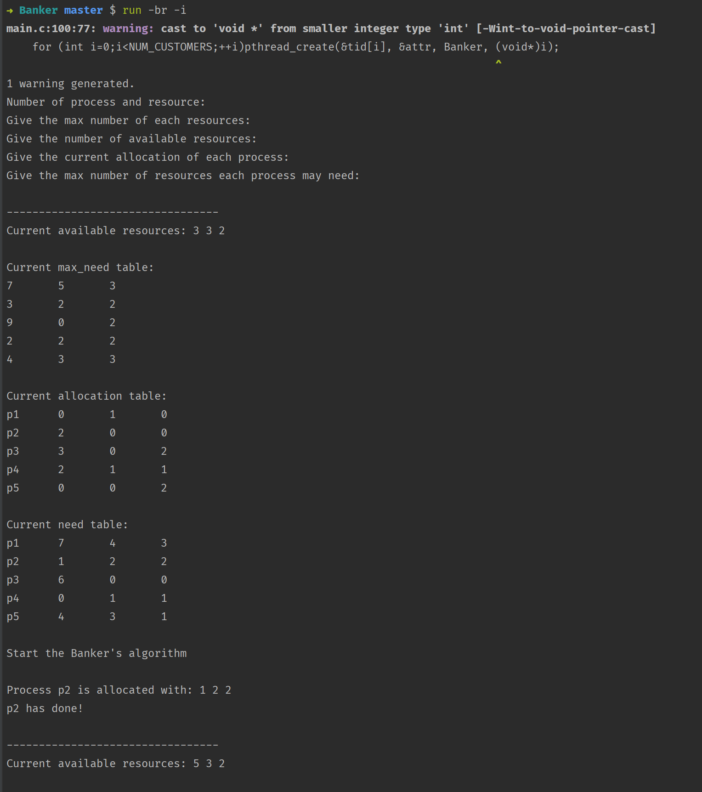

## **编译与运行*

- 如果你没有 `Qpro` 命令工具, 运行: `pip3 install Qpro`来安装它

- 使用以下命令来编译运行:

  ```shell
  cd Banker
  run -br -i
  ```

  程序将会被编译, 并使用 `dist/input.txt` 作为输入来运行.
  
- 可以在[Qpro](https://pypi.org/project/Qpro/)查看关于Qpro的各种使用方法.


## 什么是银行家算法?

- 银行家算法是一个简单用于处理死锁的算法, 它的思路很简单, 
- 如果当前资源能被某一进程分配出去, 则分配. 
- 如果有进程结束则回收资源, 如此反复直到所有进程结束.


## 如何模拟实现?(模拟PPT上样例)

- 首先创建相应的矩阵和向量存储当前资源和进程状态.

- 创建5个线程模拟进程请求资源

  ```c
  #define NUM_CUSTOMERS 5
  #define NUM_RESOURCES 3
  pthread_attr_init(&attr);
  pthread_mutex_init(&mutex, NULL);
  for (int i=0;i<NUM_CUSTOMERS;++i)pthread_create(&tid[i], &attr, Banker, (void*)i);
  for (int i=0;i<NUM_CUSTOMERS;++i)pthread_join(tid[i], NULL);
  ```

- 按照银行家算法的策略分配资源, 并在进程结束后回收资源

  ```c
  void* Banker(void* Pid){
      int pid = (int)Pid;
      bool wait = true;
      while (finish[pid] == 0){
          while (wait){
              wait = false;
              for (int i=0; i < NUM_RESOURCES; ++i){
                  int need = max_need[pid][i] - curr[pid][i];
                  if (need > avail[i])wait = true;
              }
          }
          pthread_mutex_lock(&mutex);
          printf("\nProcess p%d is allocated with: ", pid+1);
          for (int i=0; i < NUM_RESOURCES; ++i){
              int need = max_need[pid][i] - curr[pid][i];
              printf("%d ", need);
              curr[pid][i] += need;
              avail[i] -= need;
          }
          finish[pid] = 1;
          for (int i=0; i < NUM_RESOURCES; ++i)if (max_need[pid][i] != curr[pid][i])finish[pid] = 0;
          if (finish[pid] == 1){
              printf("\np%d has done!\n", pid+1);
              for (int i=0; i < NUM_RESOURCES; ++i){
                  avail[i] += curr[pid][i];
                  curr[pid][i] = 0;
                  max_need[pid][i] = 0;
              }
          }
          cur_state();
          pthread_mutex_unlock(&mutex);
      }
      pthread_exit(0);
  }
  ```

- 每一进程开始前, 打印当前资源分配状态:

  ```c
  void cur_state(){
      puts("\n---------------------------------");
      printf("Current available resources: ");
      for (int i=0;i<NUM_RESOURCES;++i) printf("%d%c", avail[i], i==NUM_RESOURCES-1?'\n':' ');
      puts("\nCurrent max_need table:");
      for (int i=0;i<NUM_CUSTOMERS;++i)for (int j=0;j<NUM_RESOURCES;++j)printf("%d%c", max_need[i][j],j==NUM_RESOURCES-1?'\n':'\t');
      puts("\nCurrent allocation table:");
      for (int i=0;i<NUM_CUSTOMERS;++i){
          printf("p%d\t", i+1);
          for (int j=0;j<NUM_RESOURCES;++j)printf("%d%c", curr[i][j], j==NUM_RESOURCES-1?'\n':'\t');
      }
      puts("\nCurrent need table:");
      for (int i=0;i<NUM_CUSTOMERS;++i){
          printf("p%d\t", i+1);
          for (int j=0;j<NUM_RESOURCES;++j)printf("%d%c", max_need[i][j] - curr[i][j], j==NUM_RESOURCES-1?'\n':'\t');
      }
  }
  ```


## 输入数据:

- `dist/input.txt`:

  ```
  10 5 7
  3 3 2
  0 1 0
  2 0 0
  3 0 2
  2 1 1
  0 0 2
  7 5 3
  3 2 2
  9 0 2
  2 2 2
  4 3 3
  ```


## 程序输出

```
Number of process and resource:
Give the max number of each resources:
Give the number of available resources:
Give the current allocation of each process:
Give the max number of resources each process may need:

---------------------------------
Current available resources: 3 3 2

Current max_need table:
7	5	3
3	2	2
9	0	2
2	2	2
4	3	3

Current allocation table:
p1	0	1	0
p2	2	0	0
p3	3	0	2
p4	2	1	1
p5	0	0	2

Current need table:
p1	7	4	3
p2	1	2	2
p3	6	0	0
p4	0	1	1
p5	4	3	1

Start the Banker's algorithm

Process p2 is allocated with: 1 2 2 
p2 has done!

---------------------------------
Current available resources: 5 3 2

Current max_need table:
7	5	3
0	0	0
9	0	2
2	2	2
4	3	3

Current allocation table:
p1	0	1	0
p2	0	0	0
p3	3	0	2
p4	2	1	1
p5	0	0	2

Current need table:
p1	7	4	3
p2	0	0	0
p3	6	0	0
p4	0	1	1
p5	4	3	1

Process p5 is allocated with: 4 3 1 
p5 has done!

---------------------------------
Current available resources: 5 3 4

Current max_need table:
7	5	3
0	0	0
9	0	2
2	2	2
0	0	0

Current allocation table:
p1	0	1	0
p2	0	0	0
p3	3	0	2
p4	2	1	1
p5	0	0	0

Current need table:
p1	7	4	3
p2	0	0	0
p3	6	0	0
p4	0	1	1
p5	0	0	0

Process p4 is allocated with: 0 1 1 
p4 has done!

---------------------------------
Current available resources: 7 4 5

Current max_need table:
7	5	3
0	0	0
9	0	2
0	0	0
0	0	0

Current allocation table:
p1	0	1	0
p2	0	0	0
p3	3	0	2
p4	0	0	0
p5	0	0	0

Current need table:
p1	7	4	3
p2	0	0	0
p3	6	0	0
p4	0	0	0
p5	0	0	0

Process p3 is allocated with: 6 0 0 
p3 has done!

---------------------------------
Current available resources: 10 4 7

Current max_need table:
7	5	3
0	0	0
0	0	0
0	0	0
0	0	0

Current allocation table:
p1	0	1	0
p2	0	0	0
p3	0	0	0
p4	0	0	0
p5	0	0	0

Current need table:
p1	7	4	3
p2	0	0	0
p3	0	0	0
p4	0	0	0
p5	0	0	0

Process p1 is allocated with: 7 4 3 
p1 has done!

---------------------------------
Current available resources: 10 5 7

Current max_need table:
0	0	0
0	0	0
0	0	0
0	0	0
0	0	0

Current allocation table:
p1	0	0	0
p2	0	0	0
p3	0	0	0
p4	0	0	0
p5	0	0	0

Current need table:
p1	0	0	0
p2	0	0	0
p3	0	0	0
p4	0	0	0
p5	0	0	0

All processes have finished

```


## 运行截图:




## 感想:

通过本次实验我理解了银行家算法的具体实现, 和大致流程.

