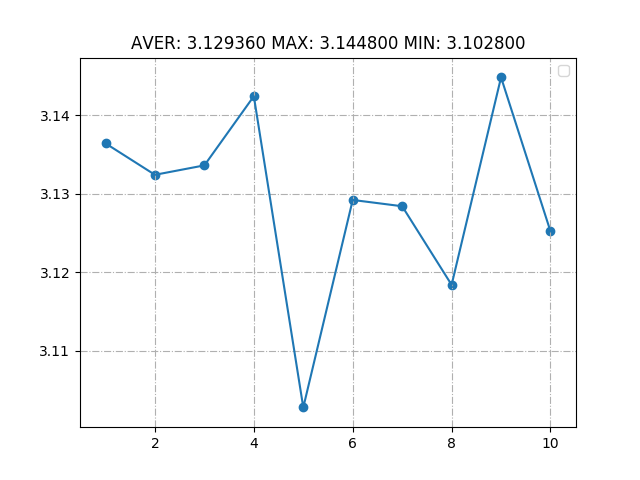
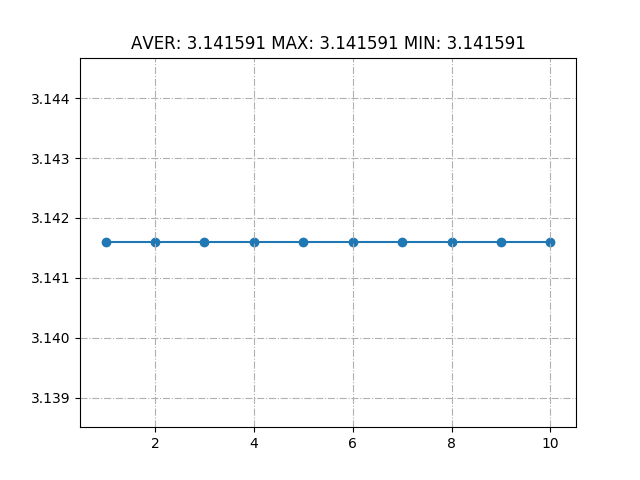

## Calculate  $\pi$  using Monte-Cario algorithm with multi threads

- I created ten threads to generate 10000 points( so each thread generated 1000 points).

- Circle function is that: $x^2 + y^2 = 1$

  ```c
  int is_in_circle(double x, double y){
      return 1.0 - x*x - y*y>=0;
  }
  ```

- If one point is in circle then variable `in_cir` plus one. Then variable `total` plus one.

  ```c
  void *build_montecario(void*args){
      for(int i =0;i<MAX_ITER;++i){
          double x=get_val(), y=get_val();
          pthread_mutex_lock(&mutex);
          ++total;
          in_cir+=is_in_circle(x,y)?1:0;
          pthread_mutex_unlock(&mutex);
      }
      return NULL;
  }
  ```

- I get $\pi$ value by calculating `in_cir/total*4`.

  Result: `in cricle:7851 total:10000 PI = 3.140400`

- Then run this program 10 times repeatly, I get a picture:



## Some operation to optimize

- Obviously, calculate  $\pi$  is just the process to calculating the area of a circle with radius 1.

- So I can calculate $\pi$ through integrating a circle of radius one. This algorithm can greatly improve accuracy and reduce complexity. (A uniform distribution is a subset of a random distribution)

- CODE:

  ```c
  float func(float x){
      return sqrt(1.0 - x*x);
  }
  
  float montecario_2017011344(float(*func)(float), float a, float b, int nseg) {
      float integral = 0, n = nseg;
      while (nseg--) {
          float x = a + (b - a) * (nseg+1)/n;
          integral += func(x);
      }
      return integral * (b - a) / n;
  }
  ```

- PICTURE:



