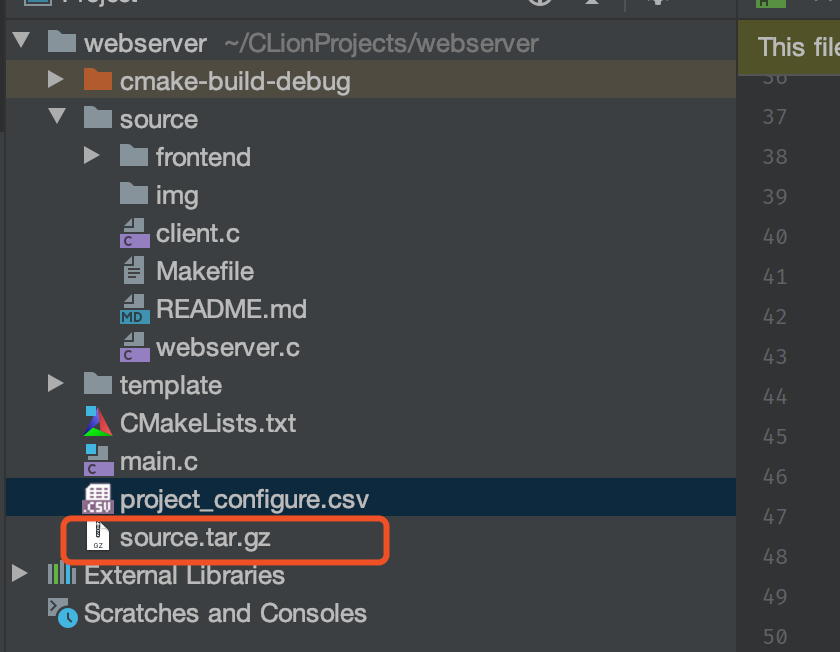
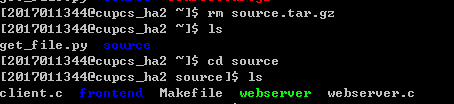
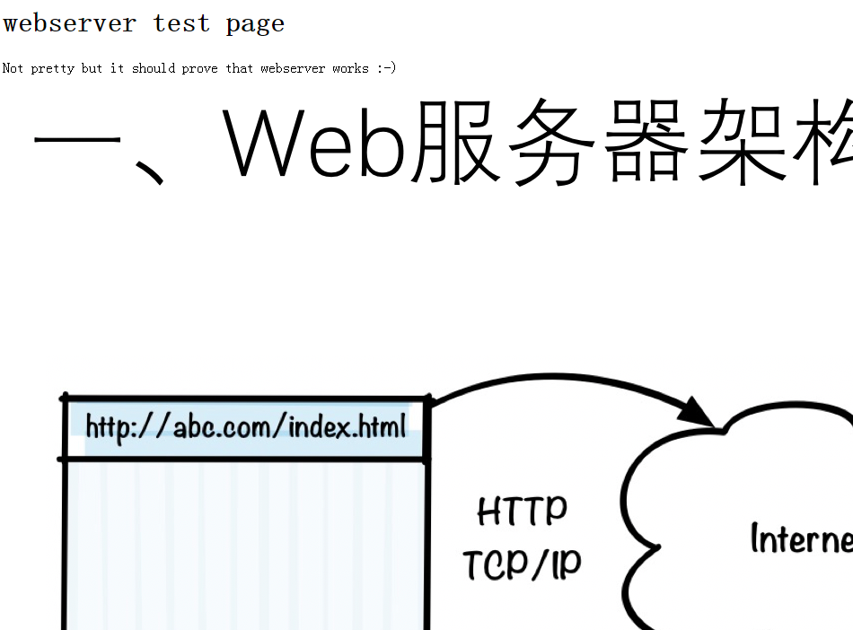
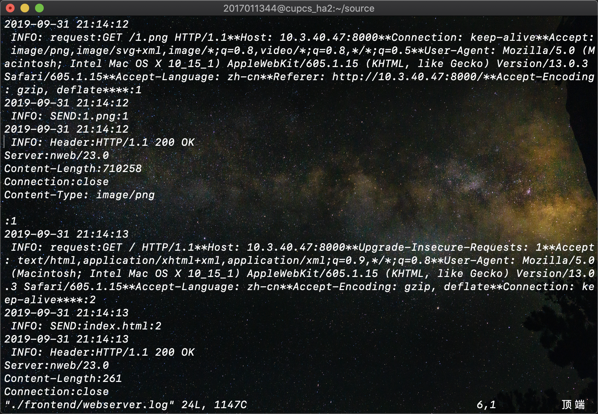
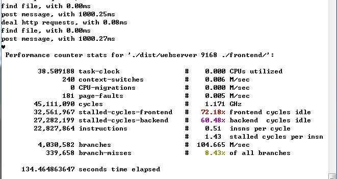

# 操作系统课程设计报告一

## 题目1

### 思考

- **按照题目要求做.**

### 设计方案

1. **首先, 抄写书中的`webserver.c`文件并把它上传给服务器**
2. **创建Makefile文件**

### 源代码

- webserver.c

```c
#include <stdio.h>
#include <stdlib.h>
#include <unistd.h>
#include <errno.h>
#include <string.h>
#include <fcntl.h>
#include <signal.h>
#include <sys/types.h>
#include <sys/socket.h>
#include <netinet/in.h>
#include <arpa/inet.h>
#define VERSION 23
#define BUFSIZE 8096
#define ERROR 42
#define LOG 44
#define FORBIDDEN 403
#define NOTFOUND 404
#ifndef SIGCLD
#define SIGCLD SIGCHLD
#endif

struct {
    char *ext;
    char *filetype;
} extensions[] = {
        {"gif",  "image/gif"},
        {"jpg",  "image/jpg"},
        {"jpeg", "image/jpeg"},
        {"png",  "image/png"},
        {"ico",  "image/ico"},
        {"zip",  "image/zip"},
        {"gz",   "image/gz"},
        {"tar",  "image/tar"},
        {"htm",  "text/html"},
        {"html", "text/html"},
        {0,      0}
};

/* 日志函数，将运行过程中的提示信息记录到 webserver.log 文件中*/

void logger(int type, char *s1, char *s2, int socket_fd) {
    int fd;
    char logbuffer[BUFSIZE * 2];
/*根据消息类型，将消息放入 logbuffer 缓存，或直接将消息通过 socket 通道返回给客户端*/
    switch (type) {
        case ERROR:
            (void) sprintf(logbuffer, "ERROR: %s:%s Errno=%d exiting pid=%d", s1, s2, errno, getpid());
            break;
        case FORBIDDEN:
            (void) write(socket_fd,
                         "HTTP/1.1 403 Forbidden\n"
                         "Content-Length: 185\n"
                         "Connection:close\n"
                         "Content-Type: text/html\n\n"
                         "<html><head>\n"
                         "<title>403 Forbidden</title>\n"
                         "</head><body>\n"
                         "<h1>Forbidden</h1>\n"
                         "The requested URL, file type or operationis not allowed on this simple static file webserver.\n"
                         "</body></html>\n",
                         271);
            (void) sprintf(logbuffer, "FORBIDDEN: %s:%s", s1, s2);
            break;
        case NOTFOUND:
            (void) write(socket_fd,
                         "HTTP/1.1 404 Not Found\n"
                         "Content-Length:136\n"
                         "Connection: close\n"
                         "Content-Type: text/html\n\n"
                         "<html><head>\n"
                         "<title>404 Not Found</title>\n"
                         "</head><body>\n"
                         "<h1>Not Found</h1>\n"
                         "The requested URL was not found on this server.\n"
                         "</body></html>\n",
                         224);
            (void) sprintf(logbuffer, "NOT FOUND: %s:%s", s1, s2);
            break;
        case LOG:
            (void) sprintf(logbuffer, " INFO: %s:%s:%d", s1, s2, socket_fd);
            break;
    }
/* 将 logbuffer 缓存中的消息存入 webserver.log 文件*/
    if ((fd = open("webserver.log", O_CREAT | O_WRONLY | O_APPEND, 0644)) >= 0) {
        (void) write(fd, logbuffer, strlen(logbuffer));
        (void) write(fd, "\n", 1);
        (void) close(fd);
    }
}

/* 此函数完成了 WebServer 主要功能，它首先解析客户端发送的消息，然后从中获取客户端请求的文

件名，然后根据文件名从本地将此文件读入缓存，并生成相应的 HTTP 响应消息；最后通过服务器与客户

端的 socket 通道向客户端返回 HTTP 响应消息*/

void web(int fd, int hit) {
    int j, file_fd, buflen;
    long i, ret, len;
    char *fstr;
    static char buffer[BUFSIZE + 1]; /* 设置静态缓冲区 */
    ret = read(fd, buffer, BUFSIZE);
/* 从连接通道中读取客户端的请求消息 */
    if (ret == 0 || ret == -1) { //如果读取客户端消息失败，则向客户端发送 HTTP 失败响应信息
        logger(FORBIDDEN, "failed to read browser request", "", fd);
    }
    if (ret > 0 && ret < BUFSIZE)
/* 设置有效字符串，即将字符串尾部表示为 0 */
        buffer[ret] = 0;
    else buffer[0] = 0;
    for (i = 0; i < ret; i++) /* 移除消息字符串中的“CF”和“LF”字符*/
        if (buffer[i] == '\r' || buffer[i] == '\n')
            buffer[i] = '*';
    logger(LOG, "request", buffer, hit);
/*判断客户端 HTTP 请求消息是否为 GET 类型，如果不是则给出相应的响应消息*/
    if (strncmp(buffer, "GET ", 4) && strncmp(buffer, "get ", 4)) {
        logger(FORBIDDEN, "Only simple GET operation supported", buffer, fd);
    }
    for (i = 4; i < BUFSIZE; i++) { /* null terminate after the second space to ignore extra stuff */
        if (buffer[i] == ' ') { /* string is "GET URL " +lots of other stuff */
            buffer[i] = 0;
            break;
        }
    }
    for (j = 0; j < i - 1; j++)
/* 在消息中检测路径，不允许路径中出现“.” */
        if (buffer[j] == '.' && buffer[j + 1] == '.') {
            logger(FORBIDDEN, "Parent directory (..) path names not supported", buffer, fd);
        }
    if (!strncmp(&buffer[0], "GET /\0", 6) || !strncmp(&buffer[0], "get /\0", 6))
/* 如果请求消息中没有包含有效的文件名，则使用默认的文件名 index.html */
        (void) strcpy(buffer, "GET /index.html");
/* 根据预定义在 extensions 中的文件类型，检查请求的文件类型是否本服务器支持 */
    buflen = strlen(buffer);
    fstr = (char *) 0;
    for (i = 0; extensions[i].ext != 0; i++) {
        len = strlen(extensions[i].ext);
        if (!strncmp(&buffer[buflen - len], extensions[i].ext, len)) {
            fstr = extensions[i].filetype;
            break;
        }
    }
    if (fstr == 0) logger(FORBIDDEN, "file extension type not supported", buffer, fd);
    if ((file_fd = open(&buffer[5], O_RDONLY)) == -1) { /* 打开指定的文件名*/
        logger(NOTFOUND, "failed to open file", &buffer[5], fd);
    }
    logger(LOG, "SEND", &buffer[5], hit);
    len = (long) lseek(file_fd, (off_t) 0, SEEK_END); /* 通过 lseek 获取文件长度*/
    (void) lseek(file_fd, (off_t) 0, SEEK_SET); /* 将文件指针移到文件首位置*/
    (void) sprintf(buffer,
                   "HTTP/1.1 200 OK\nServer:nweb/%d.0\nContent-Length:%ld\nConnection:close\nContent-Type: %s\n\n",
                   VERSION, len, fstr); /* Header + a blank line */
    logger(LOG, "Header", buffer, hit);
    (void) write(fd, buffer, strlen(buffer));
/* 不停地从文件里读取文件内容，并通过 socket 通道向客户端返回文件内容*/
    while ((ret = read(file_fd, buffer, BUFSIZE)) > 0) {
        (void) write(fd, buffer, ret);
    }
    sleep(1); /* sleep 的作用是防止消息未发出，已经将此 socket 通道关闭*/
    close(fd);
}

int main(int argc, char **argv) {
    int i, port, listenfd, socketfd, hit;
    socklen_t length;
    static struct sockaddr_in cli_addr; /* static = initialised to zeros */
    static struct sockaddr_in serv_addr; /* static = initialised to zeros */
/*解析命令参数*/
    if (argc < 3 || argc > 3 || !strcmp(argv[1], "-?")) {
        (void) printf("hint: nweb Port-Number Top-Directory\t\tversion %d\n\n"
                      "\tnweb is a small and very safe mini web server\n"
                      "\tnweb only servers out file/web pages with extensions named below\n"
                      "\t and only from the named directory or its sub-directories.\n"
                      "\tThere is no fancy features = safe and secure.\n\n"
                      "\tExample:webserver 8181 /home/nwebdir &\n\n"
                      "\tOnly Supports:", VERSION);
        for (i = 0; extensions[i].ext != 0; i++)
            (void) printf(" %s", extensions[i].ext);
        (void) printf("\n\tNot Supported: URLs including \"..\", Java, Javascript, CGI\n"
                      "\tNot Supported: directories / /etc /bin /lib /tmp /usr /dev /sbin \n"
                      "\tNo warranty given or implied\n\tNigel Griffiths nag@uk.ibm.com\n");
        exit(0);
    }
    if (!strncmp(argv[2], "/", 2) || !strncmp(argv[2], "/etc", 5) ||
        !strncmp(argv[2], "/bin", 5) || !strncmp(argv[2], "/lib", 5) ||
        !strncmp(argv[2], "/tmp", 5) || !strncmp(argv[2], "/usr", 5) ||
        !strncmp(argv[2], "/dev", 5) || !strncmp(argv[2], "/sbin", 6)) {
        (void) printf("ERROR: Bad top directory %s, see nweb -?\n", argv[2]);
        exit(3);
    }
    if (chdir(argv[2]) == -1) {
        (void) printf("ERROR: Can't Change to directory %s\n", argv[2]);
        exit(4);
    }
/* 建立服务端侦听 socket*/
    if ((listenfd = socket(AF_INET, SOCK_STREAM, 0)) < 0)
        logger(ERROR, "system call", "socket", 0);
    port = atoi(argv[1]);
    if (port < 0 || port > 60000)
        logger(ERROR, "Invalid port number (try 1->60000)", argv[1], 0);
    serv_addr.sin_family = AF_INET;
    serv_addr.sin_addr.s_addr = htonl(INADDR_ANY);
    serv_addr.sin_port = htons(port);
    if (bind(listenfd, (struct sockaddr *) &serv_addr, sizeof(serv_addr)) < 0)
        logger(ERROR, "system call", "bind", 0);
    if (listen(listenfd, 64) < 0)
        logger(ERROR, "system call", "listen", 0);
    for (hit = 1;; hit++) {
        length = sizeof(cli_addr);
        if ((socketfd = accept(listenfd, (struct sockaddr *) &cli_addr, &length)) < 0)
            logger(ERROR, "system call", "accept", 0);
        web(socketfd, hit); /* never returns */
    }
}
```

- Makefile

```makefile
webserver: webserver
	gcc webserver.c -o webserver

clean:
	rm webserver
```

### 实验过程

1. 在本机上安装我的开源库: `pip install QuickStart-Rhy` (欢迎来打星)

2. 将源程序和第二题的网页一并打包为`source.tar.gz`

   

3. 开放局域网, 准备让服务器拉取`source.tar.gz`

4. 登录服务器, 创建`get_file.py`来拉取`source.tar.gz`

   ```python
   import requests
   
   def get_file(url, file):
     url += file
   	content = requests.get(url).content
   	with open(file, 'wb') as f:
   		f.write(content)
   
   
   if __name__ == '__main__':
   	file_name = "source.tar.gz" # 替换为文件名
   	url = 'http://10.200.33.64:8000/' # 将IP地址拷贝过来
   	get_file(url, file_name)

   ```

5. 运行`python3 get_file.py`

   

   可以看到`source.tar.gz`已经被下载

   运行`tar -xzf source.tar.gz`解压, 得到source文件夹

   

### 运行结果


## 题目2

### 思考

- 设计`index.html`作为起始页面, 并运行webserver使其能被访问

### 设计方案

1. 设计前端文件夹, 并将图片和`index.html`放入文件夹
2. 运行`./webserver 8000 ./frontend`开启服务器
3. 浏览器进入指定url访问

### 源代码

- index.html

```html
<!DOCTYPE html>
<html lang="en">
<head>
    <meta charset="UTF-8">
    <title>Example</title>
</head>
<body>
    <h1>webserver test page</h1>
    <p>
        Not pretty but it should prove that webserver works :-)
    </p>
    
</body>
</html>

```

### 实验过程

1. 代码文件以由题目一方法导入

   

2. 运行`./webserver 8000 ./frontend`

   

3. 浏览器访问`http://10.3.40.47:8000/`

### 运行结果



## 题目3

### 思考

- 先实现时间获取函数, 然后照猫画虎把时间信息写进日志里.

### 设计方案

1. 实现时间函数
2. 将时间信息写进字符串里, 再在函数尾部写日志

### 源代码

- 时间获取函数及日志函数

  ```c
  void time_to_str(char*res){
      time_t t;
      time (&t);
      struct tm *lt = localtime(&t);
      sprintf(res, "%4d-%02d-%02d %02d:%02d:%02d\n",lt->tm_year+1900, lt->tm_mon, lt->tm_mday, lt->tm_hour, lt->tm_min, lt->tm_sec);
  }
  
  /* 日志函数，将运行过程中的提示信息记录到 webserver.log 文件中*/
  
  void logger(int type, char *s1, char *s2, int socket_fd) {
      int fd;
      char logbuffer[BUFSIZE * 2];
      char TIME[105];
      time_to_str(TIME);
  /*根据消息类型，将消息放入 logbuffer 缓存，或直接将消息通过 socket 通道返回给客户端*/
      switch (type) {
          case ERROR:
              (void) sprintf(logbuffer, "ERROR: %s:%s Errno=%d exiting pid=%d", s1, s2, errno, getpid());
              break;
          case FORBIDDEN:
              (void) write(socket_fd,
                           "HTTP/1.1 403 Forbidden\n"
                           "Content-Length: 185\n"
                           "Connection:close\n"
                           "Content-Type: text/html\n\n"
                           "<html><head>\n"
                           "<title>403 Forbidden</title>\n"
                           "</head><body>\n"
                           "<h1>Forbidden</h1>\n"
                           "The requested URL, file type or operationis not allowed on this simple static file webserver.\n"
                           "</body></html>\n",
                           271);
              (void) sprintf(logbuffer, "FORBIDDEN: %s:%s", s1, s2);
              break;
          case NOTFOUND:
              (void) write(socket_fd,
                           "HTTP/1.1 404 Not Found\n"
                           "Content-Length:136\n"
                           "Connection: close\n"
                           "Content-Type: text/html\n\n"
                           "<html><head>\n"
                           "<title>404 Not Found</title>\n"
                           "</head><body>\n"
                           "<h1>Not Found</h1>\n"
                           "The requested URL was not found on this server.\n"
                           "</body></html>\n",
                           224);
              (void) sprintf(logbuffer, "NOT FOUND: %s:%s", s1, s2);
              break;
          case LOG:
              (void) sprintf(logbuffer, " INFO: %s:%s:%d", s1, s2, socket_fd);
              break;
      }
  /* 将 logbuffer 缓存中的消息存入 webserver.log 文件*/
      if ((fd = open("webserver.log", O_CREAT | O_WRONLY | O_APPEND, 0644)) >= 0) {
          (void) write(fd, TIME, strlen(TIME));
          (void) write(fd, logbuffer, strlen(logbuffer));
          (void) write(fd, "\n", 1);
          (void) close(fd);
      }
  }
  ```

### 实验过程

1. 实现时间函数

   ```c
   void time_to_str(char*res){
       time_t t;
       time (&t);
       struct tm *lt = localtime(&t);
       sprintf(res, "%4d-%02d-%02d %02d:%02d:%02d\n",lt->tm_year+1900, lt->tm_mon, lt->tm_mday, lt->tm_hour, lt->tm_min, lt->tm_sec);
   }
   ```

2. 改写日志函数, 并重新编译运行.

### 运行结果



## 题目4

### 思考

- 模拟题目要求, 进行题目情况复现.

### 设计方案

1. 开启服务器, 反复刷新网页, 观察加载时间
2. 确认出现题目情况后, 关闭服务, 观察日志文件

### 源代码

- NONE

### 实验过程

1. 开启服务器, 反复刷新网页, 观察加载时间
2. 确认出现题目情况后, 关闭服务, 观察日志文件

### 运行结果

```log
:1
2019-09-31 21:20:57
 INFO: request:GET /1.png HTTP/1.1**Host: 10.3.40.47:8000**Connection: keep-alive**Accept: image/png,image/svg+xml,image/*;q=0.8,video/*;q=0.8,*/*;q=0.5**User-Agent: Mozilla/5.0 (Macintosh; Intel Mac OS X 10_15_1) AppleWebKit/605.1.15 (KHTML, like Gecko) Version/13.0.3 Safari/605.1.15**Accept-Language: zh-cn**Referer: http://10.3.40.47:8000/**Accept-Encoding: gzip, deflate****:2
2019-09-31 21:20:57
 INFO: SEND:1.png:2
2019-09-31 21:20:57
 INFO: Header:HTTP/1.1 200 OK
Server:nweb/23.0
Content-Length:710258
Connection:close
Content-Type: image/png

:2
2019-09-31 21:21:02
 INFO: request:GET / HTTP/1.1**Host: 10.3.40.47:8000**Upgrade-Insecure-Requests: 1**Accept: text/html,application/xhtml+xml,application/xml;q=0.9,*/*;q=0.8**User-Agent: Mozilla/5.0 (Macintosh; Intel Mac OS X 10_15_1) AppleWebKit/605.1.15 (KHTML, like Gecko) Version/13.0.3 Safari/605.1.15**Accept-Language: zh-cn**Accept-Encoding: gzip, deflate**Connection: keep-alive****:3
2019-09-31 21:21:02
 INFO: SEND:index.html:3
2019-09-31 21:21:02
 INFO: Header:HTTP/1.1 200 OK
Server:nweb/23.0
Content-Length:261
Connection:close
Content-Type: text/html

:3
2019-09-31 21:21:03
 INFO: request:GET /1.png HTTP/1.1**Host: 10.3.40.47:8000**Connection: keep-alive**Accept: image/png,image/svg+xml,image/*;q=0.8,video/*;q=0.8,*/*;q=0.5**User-Agent: Mozilla/5.0 (Macintosh; Intel Mac OS X 10_15_1) AppleWebKit/605.1.15 (KHTML, like Gecko) Version/13.0.3 Safari/605.1.15**Accept-Language: zh-cn**Referer: http://10.3.40.47:8000/**Accept-Encoding: gzip, deflate****:4
2019-09-31 21:21:03
 INFO: SEND:1.png:4
2019-09-31 21:21:03
 INFO: Header:HTTP/1.1 200 OK
Server:nweb/23.0
Content-Length:710258
Connection:close
Content-Type: image/png

:4
2019-09-31 21:21:05
 INFO: request:GET / HTTP/1.1**Host: 10.3.40.47:8000**Upgrade-Insecure-Requests: 1**Accept: text/html,application/xhtml+xml,application/xml;q=0.9,*/*;q=0.8**User-Agent: Mozilla/5.0 (Macintosh; Intel Mac OS X 10_15_1) AppleWebKit/605.1.15 (KHTML, like Gecko) Version/13.0.3 Safari/605.1.15**Accept-Language: zh-cn**Accept-Encoding: gzip, deflate**Connection: keep-alive****:5
2019-09-31 21:21:05
 INFO: SEND:index.html:5
2019-09-31 21:21:05
 INFO: Header:HTTP/1.1 200 OK
Server:nweb/23.0
Content-Length:261
Connection:close
Content-Type: text/html

:5
2019-09-31 21:21:06
 INFO: request:GET /1.png HTTP/1.1**Host: 10.3.40.47:8000**Connection: keep-alive**Accept: image/png,image/svg+xml,image/*;q=0.8,video/*;q=0.8,*/*;q=0.5**User-Agent: Mozilla/5.0 (Macintosh; Intel Mac OS X 10_15_1) AppleWebKit/605.1.15 (KHTML, like Gecko) Version/13.0.3 Safari/605.1.15**Accept-Language: zh-cn**Referer: http://10.3.40.47:8000/**Accept-Encoding: gzip, deflate****:6
2019-09-31 21:21:06
 INFO: SEND:1.png:6
2019-09-31 21:21:06
 INFO: Header:HTTP/1.1 200 OK
Server:nweb/23.0
Content-Length:710258
Connection:close
Content-Type: image/png
```

- **分析**: 从日志文件分析看出, 每次刷新页面时, 客户端浏览器都会**重新向服务器发送请求**, 服务器响应后, 分批次将HTML文件和图片文件发送给客户端, 而**数据重发的过程是比较耗时的**, 浏览器**重新加载资源并显示**也要耗费相当的时间.

## 题目5

### 思考

- 开启web服务, 在服务器端开启vmstat, iostat, iotop等工具测服务器状态
- 在客户端使用http_load工具对服务器进行压测, 收集数据并分析

### 设计方案

- 先开启web服务和相关工具, 如vmstat, iostat, iotop等.
- 在客户端使用http_load工具对服务器进行压测, 收集数据并分析

### 源代码

NONE

### 实验过程

1. 开启web服务, 和相关测试工具.

2. 客户端使用http_load开始压测20秒.

### 运行结果

1. 服务器测试结果:

   1. vmstat输出结果:

   ```txt
   procs -----------memory---------- ---swap-- -----io---- --system-- -----cpu-----
    r  b   swpd   free   buff  cache   si   so    bi    bo   in   cs us sy id wa st
    1  0      0 11986664 470352 2473696    0    0     0     1    1    3  0  0 100  0  0	
   procs -----------memory---------- ---swap-- -----io---- --system-- -----cpu-----
    r  b   swpd   free   buff  cache   si   so    bi    bo   in   cs us sy id wa st
    1  0      0 11986548 470352 2473700    0    0     0     1    1    3  0  0 100  0  0	
   procs -----------memory---------- ---swap-- -----io---- --system-- -----cpu-----
    r  b   swpd   free   buff  cache   si   so    bi    bo   in   cs us sy id wa st
    1  1      0 11986276 470352 2473700    0    0     0     1    1    3  0  0 100  0  0	
   procs -----------memory---------- ---swap-- -----io---- --system-- -----cpu-----
    r  b   swpd   free   buff  cache   si   so    bi    bo   in   cs us sy id wa st
    1  0      0 11985640 470360 2473696    0    0     0     1    1    3  0  0 100  0  0	
   procs -----------memory---------- ---swap-- -----io---- --system-- -----cpu-----
    r  b   swpd   free   buff  cache   si   so    bi    bo   in   cs us sy id wa st
    0  0      0 11985128 470360 2473704    0    0     0     1    1    3  0  0 100  0  0	
   procs -----------memory---------- ---swap-- -----io---- --system-- -----cpu-----
    r  b   swpd   free   buff  cache   si   so    bi    bo   in   cs us sy id wa st
    0  0      0 11984988 470360 2473704    0    0     0     1    1    3  0  0 100  0  0	
   procs -----------memory---------- ---swap-- -----io---- --system-- -----cpu-----
    r  b   swpd   free   buff  cache   si   so    bi    bo   in   cs us sy id wa st
    0  0      0 11985188 470360 2473704    0    0     0     1    1    3  0  0 100  0  0	
   procs -----------memory---------- ---swap-- -----io---- --system-- -----cpu-----
    r  b   swpd   free   buff  cache   si   so    bi    bo   in   cs us sy id wa st
    0  0      0 11985040 470360 2473704    0    0     0     1    1    3  0  0 100  0  0	
   procs -----------memory---------- ---swap-- -----io---- --system-- -----cpu-----
    r  b   swpd   free   buff  cache   si   so    bi    bo   in   cs us sy id wa st
    0  0      0 11984924 470368 2473704    0    0     0     1    1    3  0  0 100  0  0	
   procs -----------memory---------- ---swap-- -----io---- --system-- -----cpu-----
    r  b   swpd   free   buff  cache   si   so    bi    bo   in   cs us sy id wa st
    0  0      0 11985348 470368 2473704    0    0     0     1    1    3  0  0 100  0  0	
   procs -----------memory---------- ---swap-- -----io---- --system-- -----cpu-----
    r  b   swpd   free   buff  cache   si   so    bi    bo   in   cs us sy id wa st
    0  0      0 11985216 470368 2473704    0    0     0     1    1    3  0  0 100  0  0	
   procs -----------memory---------- ---swap-- -----io---- --system-- -----cpu-----
    r  b   swpd   free   buff  cache   si   so    bi    bo   in   cs us sy id wa st
    0  0      0 11985456 470368 2473708    0    0     0     1    1    3  0  0 100  0  0	
   procs -----------memory---------- ---swap-- -----io---- --system-- -----cpu-----
    r  b   swpd   free   buff  cache   si   so    bi    bo   in   cs us sy id wa st
    2  1      0 11984092 470372 2473704    0    0     0     1    1    3  0  0 100  0  0	
   procs -----------memory---------- ---swap-- -----io---- --system-- -----cpu-----
    r  b   swpd   free   buff  cache   si   so    bi    bo   in   cs us sy id wa st
    0  0      0 11983720 470380 2473712    0    0     0     1    1    3  0  0 100  0  0	
   procs -----------memory---------- ---swap-- -----io---- --system-- -----cpu-----
    r  b   swpd   free   buff  cache   si   so    bi    bo   in   cs us sy id wa st
    2  0      0 11981108 470380 2476772    0    0     0     1    1    3  0  0 100  0  0	
   procs -----------memory---------- ---swap-- -----io---- --system-- -----cpu-----
    r  b   swpd   free   buff  cache   si   so    bi    bo   in   cs us sy id wa st
    0  0      0 11983852 470380 2473712    0    0     0     1    1    3  0  0 100  0  0	
   procs -----------memory---------- ---swap-- -----io---- --system-- -----cpu-----
    r  b   swpd   free   buff  cache   si   so    bi    bo   in   cs us sy id wa st
    0  0      0 11983704 470380 2473712    0    0     0     1    1    3  0  0 100  0  0	
   procs -----------memory---------- ---swap-- -----io---- --system-- -----cpu-----
    r  b   swpd   free   buff  cache   si   so    bi    bo   in   cs us sy id wa st
    3  1      0 11981232 470380 2476776    0    0     0     1    1    3  0  0 100  0  0	
   procs -----------memory---------- ---swap-- -----io---- --system-- -----cpu-----
    r  b   swpd   free   buff  cache   si   so    bi    bo   in   cs us sy id wa st
    0  0      0 11983572 470388 2473716    0    0     0     1    1    3  0  0 100  0  0	
   procs -----------memory---------- ---swap-- -----io---- --system-- -----cpu-----
    r  b   swpd   free   buff  cache   si   so    bi    bo   in   cs us sy id wa st
    0  0      0 11983564 470388 2473716    0    0     0     1    1    3  0  0 100  0  0	
   procs -----------memory---------- ---swap-- -----io---- --system-- -----cpu-----
    r  b   swpd   free   buff  cache   si   so    bi    bo   in   cs us sy id wa st
    1  0      0 11987040 470420 2473716    0    0     0     1    1    3  0  0 100  0  0	
   procs -----------memory---------- ---swap-- -----io---- --system-- -----cpu-----
    r  b   swpd   free   buff  cache   si   so    bi    bo   in   cs us sy id wa st
    1  0      0 11985264 470428 2473708    0    0     0     1    1    3  0  0 100  0  0	
   procs -----------memory---------- ---swap-- -----io---- --system-- -----cpu-----
    r  b   swpd   free   buff  cache   si   so    bi    bo   in   cs us sy id wa st
    0  0      0 11985388 470428 2473720    0    0     0     1    1    3  0  0 100  0  0	
   procs -----------memory---------- ---swap-- -----io---- --system-- -----cpu-----
    r  b   swpd   free   buff  cache   si   so    bi    bo   in   cs us sy id wa st
    0  0      0 11984588 470428 2473720    0    0     0     1    1    3  0  0 100  0  0	
   procs -----------memory---------- ---swap-- -----io---- --system-- -----cpu-----
    r  b   swpd   free   buff  cache   si   so    bi    bo   in   cs us sy id wa st
    0  0      0 11984852 470428 2473720    0    0     0     1    1    3  0  0 100  0  0	
   procs -----------memory---------- ---swap-- -----io---- --system-- -----cpu-----
    r  b   swpd   free   buff  cache   si   so    bi    bo   in   cs us sy id wa st
    1  0      0 11984220 470428 2473720    0    0     0     1    1    3  0  0 100  0  0	
   procs -----------memory---------- ---swap-- -----io---- --system-- -----cpu-----
    r  b   swpd   free   buff  cache   si   so    bi    bo   in   cs us sy id wa st
    1  0      0 11984848 470428 2473720    0    0     0     1    1    3  0  0 100  0  0	
   procs -----------memory---------- ---swap-- -----io---- --system-- -----cpu-----
    r  b   swpd   free   buff  cache   si   so    bi    bo   in   cs us sy id wa st
    1  0      0 11984592 470436 2473720    0    0     0     1    1    3  0  0 100  0  0	
   procs -----------memory---------- ---swap-- -----io---- --system-- -----cpu-----
    r  b   swpd   free   buff  cache   si   so    bi    bo   in   cs us sy id wa st
    1  0      0 11984468 470436 2473720    0    0     0     1    1    3  0  0 100  0  0	
   procs -----------memory---------- ---swap-- -----io---- --system-- -----cpu-----
    r  b   swpd   free   buff  cache   si   so    bi    bo   in   cs us sy id wa st
    1  0      0 11985220 470436 2473720    0    0     0     1    1    3  0  0 100  0  0	
   procs -----------memory---------- ---swap-- -----io---- --system-- -----cpu-----
    r  b   swpd   free   buff  cache   si   so    bi    bo   in   cs us sy id wa st
    0  0      0 11985180 470436 2473720    0    0     0     1    1    3  0  0 100  0  0	
   procs -----------memory---------- ---swap-- -----io---- --system-- -----cpu-----
    r  b   swpd   free   buff  cache   si   so    bi    bo   in   cs us sy id wa st
    0  0      0 11985404 470436 2473720    0    0     0     1    1    3  0  0 100  0  0	
   procs -----------memory---------- ---swap-- -----io---- --system-- -----cpu-----
    r  b   swpd   free   buff  cache   si   so    bi    bo   in   cs us sy id wa st
    0  0      0 11985404 470444 2473724    0    0     0     1    1    3  0  0 100  0  0	
   procs -----------memory---------- ---swap-- -----io---- --system-- -----cpu-----
    r  b   swpd   free   buff  cache   si   so    bi    bo   in   cs us sy id wa st
    0  0      0 11985436 470444 2473724    0    0     0     1    1    3  0  0 100  0  0	
   procs -----------memory---------- ---swap-- -----io---- --system-- -----cpu-----
    r  b   swpd   free   buff  cache   si   so    bi    bo   in   cs us sy id wa st
    0  0      0 11985560 470444 2473728    0    0     0     1    1    3  0  0 100  0  0	
   procs -----------memory---------- ---swap-- -----io---- --system-- -----cpu-----
    r  b   swpd   free   buff  cache   si   so    bi    bo   in   cs us sy id wa st
    0  0      0 11985320 470444 2473728    0    0     0     1    1    3  0  0 100  0  0	
   procs -----------memory---------- ---swap-- -----io---- --system-- -----cpu-----
    r  b   swpd   free   buff  cache   si   so    bi    bo   in   cs us sy id wa st
    0  0      0 11985188 470444 2473588    0    0     0     1    1    3  0  0 100  0  0	
   procs -----------memory---------- ---swap-- -----io---- --system-- -----cpu-----
    r  b   swpd   free   buff  cache   si   so    bi    bo   in   cs us sy id wa st
    0  0      0 11985444 470452 2473728    0    0     0     1    1    3  0  0 100  0  0	
   procs -----------memory---------- ---swap-- -----io---- --system-- -----cpu-----
    r  b   swpd   free   buff  cache   si   so    bi    bo   in   cs us sy id wa st
    0  0      0 11985676 470452 2473728    0    0     0     1    1    3  0  0 100  0  0	
   procs -----------memory---------- ---swap-- -----io---- --system-- -----cpu-----
    r  b   swpd   free   buff  cache   si   so    bi    bo   in   cs us sy id wa st
    0  0      0 11985560 470452 2473588    0    0     0     1    1    3  0  0 100  0  0	
   ```

   2. Iostat

   ```txt
   Linux 2.6.32-220.el6.x86_64 (cupcs_ha2) 	2019年11月04日 	_x86_64_	(8 CPU)
   
   avg-cpu:  %user   %nice %system %iowait  %steal   %idle
              0.07    0.06    0.24    0.00    0.00   99.62
   
   Device:            tps   Blk_read/s   Blk_wrtn/s   Blk_read   Blk_wrtn
   sda               0.58         1.68        21.12    2501372   31452592
   sdb               0.03         0.12         2.13     172412    3169200
   
   Linux 2.6.32-220.el6.x86_64 (cupcs_ha2) 	2019年11月04日 	_x86_64_	(8 CPU)
   
   avg-cpu:  %user   %nice %system %iowait  %steal   %idle
              0.07    0.06    0.24    0.00    0.00   99.62
   
   Device:            tps   Blk_read/s   Blk_wrtn/s   Blk_read   Blk_wrtn
   sda               0.58         1.68        21.12    2501372   31452592
   sdb               0.03         0.12         2.13     172412    3169200
   
   Linux 2.6.32-220.el6.x86_64 (cupcs_ha2) 	2019年11月04日 	_x86_64_	(8 CPU)
   
   avg-cpu:  %user   %nice %system %iowait  %steal   %idle
              0.07    0.06    0.24    0.00    0.00   99.62
   
   Device:            tps   Blk_read/s   Blk_wrtn/s   Blk_read   Blk_wrtn
   sda               0.58         1.68        21.12    2501372   31452592
   sdb               0.03         0.12         2.13     172412    3169288
   
   Linux 2.6.32-220.el6.x86_64 (cupcs_ha2) 	2019年11月04日 	_x86_64_	(8 CPU)
   
   avg-cpu:  %user   %nice %system %iowait  %steal   %idle
              0.07    0.06    0.24    0.00    0.00   99.62
   
   Device:            tps   Blk_read/s   Blk_wrtn/s   Blk_read   Blk_wrtn
   sda               0.58         1.68        21.12    2501372   31452688
   sdb               0.03         0.12         2.13     172412    3169288
   
   Linux 2.6.32-220.el6.x86_64 (cupcs_ha2) 	2019年11月04日 	_x86_64_	(8 CPU)
   
   avg-cpu:  %user   %nice %system %iowait  %steal   %idle
              0.07    0.06    0.24    0.00    0.00   99.62
   
   Device:            tps   Blk_read/s   Blk_wrtn/s   Blk_read   Blk_wrtn
   sda               0.58         1.68        21.12    2501372   31452688
   sdb               0.03         0.12         2.13     172412    3169288
   
   Linux 2.6.32-220.el6.x86_64 (cupcs_ha2) 	2019年11月04日 	_x86_64_	(8 CPU)
   
   avg-cpu:  %user   %nice %system %iowait  %steal   %idle
              0.07    0.06    0.24    0.00    0.00   99.62
   
   Device:            tps   Blk_read/s   Blk_wrtn/s   Blk_read   Blk_wrtn
   sda               0.58         1.68        21.12    2501372   31452688
   sdb               0.03         0.12         2.13     172412    3169288
   
   Linux 2.6.32-220.el6.x86_64 (cupcs_ha2) 	2019年11月04日 	_x86_64_	(8 CPU)
   
   avg-cpu:  %user   %nice %system %iowait  %steal   %idle
              0.07    0.06    0.24    0.00    0.00   99.62
   
   Device:            tps   Blk_read/s   Blk_wrtn/s   Blk_read   Blk_wrtn
   sda               0.58         1.68        21.12    2501372   31452688
   sdb               0.03         0.12         2.13     172412    3169288
   
   Linux 2.6.32-220.el6.x86_64 (cupcs_ha2) 	2019年11月04日 	_x86_64_	(8 CPU)
   
   avg-cpu:  %user   %nice %system %iowait  %steal   %idle
              0.07    0.06    0.24    0.00    0.00   99.62
   
   Device:            tps   Blk_read/s   Blk_wrtn/s   Blk_read   Blk_wrtn
   sda               0.58         1.68        21.12    2501372   31452688
   sdb               0.03         0.12         2.13     172412    3169328
   
   Linux 2.6.32-220.el6.x86_64 (cupcs_ha2) 	2019年11月04日 	_x86_64_	(8 CPU)
   
   avg-cpu:  %user   %nice %system %iowait  %steal   %idle
              0.07    0.06    0.24    0.00    0.00   99.62
   
   Device:            tps   Blk_read/s   Blk_wrtn/s   Blk_read   Blk_wrtn
   sda               0.58         1.68        21.12    2501372   31452784
   sdb               0.03         0.12         2.13     172412    3169328
   
   Linux 2.6.32-220.el6.x86_64 (cupcs_ha2) 	2019年11月04日 	_x86_64_	(8 CPU)
   
   avg-cpu:  %user   %nice %system %iowait  %steal   %idle
              0.07    0.06    0.24    0.00    0.00   99.62
   
   Device:            tps   Blk_read/s   Blk_wrtn/s   Blk_read   Blk_wrtn
   sda               0.58         1.68        21.12    2501372   31452784
   sdb               0.03         0.12         2.13     172412    3169328
   
   Linux 2.6.32-220.el6.x86_64 (cupcs_ha2) 	2019年11月04日 	_x86_64_	(8 CPU)
   
   avg-cpu:  %user   %nice %system %iowait  %steal   %idle
              0.07    0.06    0.24    0.00    0.00   99.62
   
   Device:            tps   Blk_read/s   Blk_wrtn/s   Blk_read   Blk_wrtn
   sda               0.58         1.68        21.12    2501372   31452784
   sdb               0.03         0.12         2.13     172412    3169328
   
   Linux 2.6.32-220.el6.x86_64 (cupcs_ha2) 	2019年11月04日 	_x86_64_	(8 CPU)
   
   avg-cpu:  %user   %nice %system %iowait  %steal   %idle
              0.07    0.06    0.24    0.00    0.00   99.62
   
   Device:            tps   Blk_read/s   Blk_wrtn/s   Blk_read   Blk_wrtn
   sda               0.58         1.68        21.12    2501372   31452784
   sdb               0.03         0.12         2.13     172412    3169328
   
   Linux 2.6.32-220.el6.x86_64 (cupcs_ha2) 	2019年11月04日 	_x86_64_	(8 CPU)
   
   avg-cpu:  %user   %nice %system %iowait  %steal   %idle
              0.07    0.06    0.24    0.00    0.00   99.62
   
   Device:            tps   Blk_read/s   Blk_wrtn/s   Blk_read   Blk_wrtn
   sda               0.58         1.68        21.12    2501372   31452784
   sdb               0.03         0.12         2.13     172412    3169440
   
   Linux 2.6.32-220.el6.x86_64 (cupcs_ha2) 	2019年11月04日 	_x86_64_	(8 CPU)
   
   avg-cpu:  %user   %nice %system %iowait  %steal   %idle
              0.07    0.06    0.24    0.00    0.00   99.62
   
   Device:            tps   Blk_read/s   Blk_wrtn/s   Blk_read   Blk_wrtn
   sda               0.58         1.68        21.12    2501372   31452896
   sdb               0.03         0.12         2.13     172412    3169440
   
   Linux 2.6.32-220.el6.x86_64 (cupcs_ha2) 	2019年11月04日 	_x86_64_	(8 CPU)
   
   avg-cpu:  %user   %nice %system %iowait  %steal   %idle
              0.07    0.06    0.24    0.00    0.00   99.62
   
   Device:            tps   Blk_read/s   Blk_wrtn/s   Blk_read   Blk_wrtn
   sda               0.58         1.68        21.12    2501372   31452896
   sdb               0.03         0.12         2.13     172412    3169440
   
   Linux 2.6.32-220.el6.x86_64 (cupcs_ha2) 	2019年11月04日 	_x86_64_	(8 CPU)
   
   avg-cpu:  %user   %nice %system %iowait  %steal   %idle
              0.07    0.06    0.24    0.00    0.00   99.62
   
   Device:            tps   Blk_read/s   Blk_wrtn/s   Blk_read   Blk_wrtn
   sda               0.58         1.68        21.12    2501372   31452896
   sdb               0.03         0.12         2.13     172412    3169440
   
   Linux 2.6.32-220.el6.x86_64 (cupcs_ha2) 	2019年11月04日 	_x86_64_	(8 CPU)
   
   avg-cpu:  %user   %nice %system %iowait  %steal   %idle
              0.07    0.06    0.24    0.00    0.00   99.62
   
   Device:            tps   Blk_read/s   Blk_wrtn/s   Blk_read   Blk_wrtn
   sda               0.58         1.68        21.12    2501372   31452896
   sdb               0.03         0.12         2.13     172412    3169440
   
   Linux 2.6.32-220.el6.x86_64 (cupcs_ha2) 	2019年11月04日 	_x86_64_	(8 CPU)
   
   avg-cpu:  %user   %nice %system %iowait  %steal   %idle
              0.07    0.06    0.24    0.00    0.00   99.62
   
   Device:            tps   Blk_read/s   Blk_wrtn/s   Blk_read   Blk_wrtn
   sda               0.58         1.68        21.12    2501372   31452896
   sdb               0.03         0.12         2.13     172412    3169504
   
   Linux 2.6.32-220.el6.x86_64 (cupcs_ha2) 	2019年11月04日 	_x86_64_	(8 CPU)
   
   avg-cpu:  %user   %nice %system %iowait  %steal   %idle
              0.07    0.06    0.24    0.00    0.00   99.62
   
   Device:            tps   Blk_read/s   Blk_wrtn/s   Blk_read   Blk_wrtn
   sda               0.58         1.68        21.12    2501372   31452896
   sdb               0.03         0.12         2.13     172412    3169504
   
   Linux 2.6.32-220.el6.x86_64 (cupcs_ha2) 	2019年11月04日 	_x86_64_	(8 CPU)
   
   avg-cpu:  %user   %nice %system %iowait  %steal   %idle
              0.07    0.06    0.24    0.00    0.00   99.62
   
   Device:            tps   Blk_read/s   Blk_wrtn/s   Blk_read   Blk_wrtn
   sda               0.58         1.68        21.12    2501372   31453024
   sdb               0.03         0.12         2.13     172412    3169504
   
   Linux 2.6.32-220.el6.x86_64 (cupcs_ha2) 	2019年11月04日 	_x86_64_	(8 CPU)
   
   avg-cpu:  %user   %nice %system %iowait  %steal   %idle
              0.07    0.06    0.24    0.00    0.00   99.62
   
   Device:            tps   Blk_read/s   Blk_wrtn/s   Blk_read   Blk_wrtn
   sda               0.58         1.68        21.12    2501372   31453688
   sdb               0.03         0.12         2.13     172412    3169800
   
   Linux 2.6.32-220.el6.x86_64 (cupcs_ha2) 	2019年11月04日 	_x86_64_	(8 CPU)
   
   avg-cpu:  %user   %nice %system %iowait  %steal   %idle
              0.07    0.06    0.24    0.00    0.00   99.62
   
   Device:            tps   Blk_read/s   Blk_wrtn/s   Blk_read   Blk_wrtn
   sda               0.58         1.68        21.12    2501372   31453688
   sdb               0.03         0.12         2.13     172412    3169936
   
   Linux 2.6.32-220.el6.x86_64 (cupcs_ha2) 	2019年11月04日 	_x86_64_	(8 CPU)
   
   avg-cpu:  %user   %nice %system %iowait  %steal   %idle
              0.07    0.06    0.24    0.00    0.00   99.62
   
   Device:            tps   Blk_read/s   Blk_wrtn/s   Blk_read   Blk_wrtn
   sda               0.58         1.68        21.12    2501372   31453784
   sdb               0.03         0.12         2.13     172412    3169952
   
   Linux 2.6.32-220.el6.x86_64 (cupcs_ha2) 	2019年11月04日 	_x86_64_	(8 CPU)
   
   avg-cpu:  %user   %nice %system %iowait  %steal   %idle
              0.07    0.06    0.24    0.00    0.00   99.62
   
   Device:            tps   Blk_read/s   Blk_wrtn/s   Blk_read   Blk_wrtn
   sda               0.58         1.68        21.12    2501372   31453784
   sdb               0.03         0.12         2.13     172412    3169952
   
   Linux 2.6.32-220.el6.x86_64 (cupcs_ha2) 	2019年11月04日 	_x86_64_	(8 CPU)
   
   avg-cpu:  %user   %nice %system %iowait  %steal   %idle
              0.07    0.06    0.24    0.00    0.00   99.62
   
   Device:            tps   Blk_read/s   Blk_wrtn/s   Blk_read   Blk_wrtn
   sda               0.58         1.68        21.12    2501372   31453784
   sdb               0.03         0.12         2.13     172412    3169952
   
   Linux 2.6.32-220.el6.x86_64 (cupcs_ha2) 	2019年11月04日 	_x86_64_	(8 CPU)
   
   avg-cpu:  %user   %nice %system %iowait  %steal   %idle
              0.07    0.06    0.24    0.00    0.00   99.62
   
   Device:            tps   Blk_read/s   Blk_wrtn/s   Blk_read   Blk_wrtn
   sda               0.58         1.68        21.12    2501372   31453784
   sdb               0.03         0.12         2.13     172412    3169952
   
   Linux 2.6.32-220.el6.x86_64 (cupcs_ha2) 	2019年11月04日 	_x86_64_	(8 CPU)
   
   avg-cpu:  %user   %nice %system %iowait  %steal   %idle
              0.07    0.06    0.24    0.00    0.00   99.62
   
   Device:            tps   Blk_read/s   Blk_wrtn/s   Blk_read   Blk_wrtn
   sda               0.58         1.68        21.12    2501372   31453784
   sdb               0.03         0.12         2.13     172412    3169992
   
   Linux 2.6.32-220.el6.x86_64 (cupcs_ha2) 	2019年11月04日 	_x86_64_	(8 CPU)
   
   avg-cpu:  %user   %nice %system %iowait  %steal   %idle
              0.07    0.06    0.24    0.00    0.00   99.62
   
   Device:            tps   Blk_read/s   Blk_wrtn/s   Blk_read   Blk_wrtn
   sda               0.58         1.68        21.12    2501372   31453880
   sdb               0.03         0.12         2.13     172412    3169992
   
   Linux 2.6.32-220.el6.x86_64 (cupcs_ha2) 	2019年11月04日 	_x86_64_	(8 CPU)
   
   avg-cpu:  %user   %nice %system %iowait  %steal   %idle
              0.07    0.06    0.24    0.00    0.00   99.62
   
   Device:            tps   Blk_read/s   Blk_wrtn/s   Blk_read   Blk_wrtn
   sda               0.58         1.68        21.12    2501372   31453880
   sdb               0.03         0.12         2.13     172412    3169992
   
   Linux 2.6.32-220.el6.x86_64 (cupcs_ha2) 	2019年11月04日 	_x86_64_	(8 CPU)
   
   avg-cpu:  %user   %nice %system %iowait  %steal   %idle
              0.07    0.06    0.24    0.00    0.00   99.62
   
   Device:            tps   Blk_read/s   Blk_wrtn/s   Blk_read   Blk_wrtn
   sda               0.58         1.68        21.12    2501372   31453880
   sdb               0.03         0.12         2.13     172412    3169992
   
   Linux 2.6.32-220.el6.x86_64 (cupcs_ha2) 	2019年11月04日 	_x86_64_	(8 CPU)
   
   avg-cpu:  %user   %nice %system %iowait  %steal   %idle
              0.07    0.06    0.24    0.00    0.00   99.62
   
   Device:            tps   Blk_read/s   Blk_wrtn/s   Blk_read   Blk_wrtn
   sda               0.58         1.68        21.12    2501372   31453880
   sdb               0.03         0.12         2.13     172412    3169992
   
   Linux 2.6.32-220.el6.x86_64 (cupcs_ha2) 	2019年11月04日 	_x86_64_	(8 CPU)
   
   avg-cpu:  %user   %nice %system %iowait  %steal   %idle
              0.07    0.06    0.24    0.00    0.00   99.62
   
   Device:            tps   Blk_read/s   Blk_wrtn/s   Blk_read   Blk_wrtn
   sda               0.58         1.68        21.12    2501372   31453880
   sdb               0.03         0.12         2.13     172412    3170056
   
   Linux 2.6.32-220.el6.x86_64 (cupcs_ha2) 	2019年11月04日 	_x86_64_	(8 CPU)
   
   avg-cpu:  %user   %nice %system %iowait  %steal   %idle
              0.07    0.06    0.24    0.00    0.00   99.62
   
   Device:            tps   Blk_read/s   Blk_wrtn/s   Blk_read   Blk_wrtn
   sda               0.58         1.68        21.12    2501372   31453976
   sdb               0.03         0.12         2.13     172412    3170056
   
   Linux 2.6.32-220.el6.x86_64 (cupcs_ha2) 	2019年11月04日 	_x86_64_	(8 CPU)
   
   avg-cpu:  %user   %nice %system %iowait  %steal   %idle
              0.07    0.06    0.24    0.00    0.00   99.62
   
   Device:            tps   Blk_read/s   Blk_wrtn/s   Blk_read   Blk_wrtn
   sda               0.58         1.68        21.12    2501372   31453976
   sdb               0.03         0.12         2.13     172412    3170056
   
   Linux 2.6.32-220.el6.x86_64 (cupcs_ha2) 	2019年11月04日 	_x86_64_	(8 CPU)
   
   avg-cpu:  %user   %nice %system %iowait  %steal   %idle
              0.07    0.06    0.24    0.00    0.00   99.62
   
   Device:            tps   Blk_read/s   Blk_wrtn/s   Blk_read   Blk_wrtn
   sda               0.58         1.68        21.12    2501372   31453976
   sdb               0.03         0.12         2.13     172412    3170056
   
   Linux 2.6.32-220.el6.x86_64 (cupcs_ha2) 	2019年11月04日 	_x86_64_	(8 CPU)
   
   avg-cpu:  %user   %nice %system %iowait  %steal   %idle
              0.07    0.06    0.24    0.00    0.00   99.62
   
   Device:            tps   Blk_read/s   Blk_wrtn/s   Blk_read   Blk_wrtn
   sda               0.58         1.68        21.12    2501372   31453976
   sdb               0.03         0.12         2.13     172412    3170056
   
   Linux 2.6.32-220.el6.x86_64 (cupcs_ha2) 	2019年11月04日 	_x86_64_	(8 CPU)
   
   avg-cpu:  %user   %nice %system %iowait  %steal   %idle
              0.07    0.06    0.24    0.00    0.00   99.62
   
   Device:            tps   Blk_read/s   Blk_wrtn/s   Blk_read   Blk_wrtn
   sda               0.58         1.68        21.12    2501372   31453976
   sdb               0.03         0.12         2.13     172412    3170120
   
   Linux 2.6.32-220.el6.x86_64 (cupcs_ha2) 	2019年11月04日 	_x86_64_	(8 CPU)
   
   avg-cpu:  %user   %nice %system %iowait  %steal   %idle
              0.07    0.06    0.24    0.00    0.00   99.62
   
   Device:            tps   Blk_read/s   Blk_wrtn/s   Blk_read   Blk_wrtn
   sda               0.58         1.68        21.12    2501372   31453976
   sdb               0.03         0.12         2.13     172412    3170120
   
   Linux 2.6.32-220.el6.x86_64 (cupcs_ha2) 	2019年11月04日 	_x86_64_	(8 CPU)
   
   avg-cpu:  %user   %nice %system %iowait  %steal   %idle
              0.07    0.06    0.24    0.00    0.00   99.62
   
   Device:            tps   Blk_read/s   Blk_wrtn/s   Blk_read   Blk_wrtn
   sda               0.58         1.68        21.12    2501372   31454072
   sdb               0.03         0.12         2.13     172412    3170120
   
   Linux 2.6.32-220.el6.x86_64 (cupcs_ha2) 	2019年11月04日 	_x86_64_	(8 CPU)
   
   avg-cpu:  %user   %nice %system %iowait  %steal   %idle
              0.07    0.06    0.24    0.00    0.00   99.62
   
   Device:            tps   Blk_read/s   Blk_wrtn/s   Blk_read   Blk_wrtn
   sda               0.58         1.68        21.12    2501372   31454072
   sdb               0.03         0.12         2.13     172412    3170120
   
   
   ```

2. http_load压测结果:

   - 命令: `http_load -parallel 5 -fetches 50 -seconds 20 urls`
   - 结果: 19次匹配, 1次失配

### 运行结果分析:

- 可以看到, 在http_load请求期间, 服务进程在单位时间内被分配的内存资源很少. 这个是因为服务进程是串行的.
- 打开`webserver.c`查看代码, 发现**终极性能优化理由**:`sleep(1)`
- 分析iostat结果, 注意到程序的IO操作频繁, 这对串行服务进程代价很大.

## 题目6

### 思考

- 按照代码中的注释, 在相应的地方添加计时函数并输出, 观察输出结果.

### 设计方案

- 针对处理一次网络请求的过程, 在解析http请求、索引文件和io部分添加计时函数。
- 写脚本每隔3秒向服务器发起一次网络请求。
- 观测每次网络请求下的服务进程输出。

### 源代码

- webtest.py

  ```python
  import requests
  import time
  
  for i in range(100):
    requests.get('http://10.3.40.47:9168')
    time.sleep(1)
  ```

- web函数

  ```c
  void web(int fd, int hit) {
      struct timeval t1, t2;
      int file_fd, buflen;
      long i,j, ret, len;
      char *fstr;
      static char buffer[BUFSIZE + 1]; /* 设置静态缓冲区 */
      gettimeofday(&t1, NULL);
      ret = read(fd, buffer, BUFSIZE);
  /* 从连接通道中读取客户端的请求消息 */
      if (ret == 0 || ret == -1) { //如果读取客户端消息失败，则向客户端发送 HTTP 失败响应信息
          logger(FORBIDDEN, "failed to read browser request", "", fd);
      }
      if (ret > 0 && ret < BUFSIZE)
  /* 设置有效字符串，即将字符串尾部表示为 0 */
          buffer[ret] = 0;
      else buffer[0] = 0;
      for (i = 0; i < ret; i++) /* 移除消息字符串中的“CF”和“LF”字符*/
          if (buffer[i] == '\r' || buffer[i] == '\n')
              buffer[i] = '*';
      logger(LOG, "request", buffer, hit);
  /*判断客户端 HTTP 请求消息是否为 GET 类型，如果不是则给出相应的响应消息*/
      if (strncmp(buffer, "GET ", 4) && strncmp(buffer, "get ", 4)) {
          logger(FORBIDDEN, "Only simple GET operation supported", buffer, fd);
      }
      for (i = 4; i < BUFSIZE; i++) { /* null terminate after the second space to ignore extra stuff */
          if (buffer[i] == ' ') { /* string is "GET URL " +lots of other stuff */
              buffer[i] = 0;
              break;
          }
      }
      gettimeofday(&t2, NULL);
      printf("deal http requests, with %.2fms\n", (t2.tv_sec - t1.tv_sec) * 1000.0 + (t2.tv_usec - t1.tv_usec) / 1000.0);
      gettimeofday(&t1, NULL);
      for (j = 0; j < i - 1; j++)
  /* 在消息中检测路径，不允许路径中出现“.” */
          if (buffer[j] == '.' && buffer[j + 1] == '.') {
              logger(FORBIDDEN, "Parent directory (..) path names not supported", buffer, fd);
          }
      if (!strncmp(&buffer[0], "GET /\0", 6) || !strncmp(&buffer[0], "get /\0", 6))
  /* 如果请求消息中没有包含有效的文件名，则使用默认的文件名 index.html */
          (void) strcpy(buffer, "GET /index.html");
  /* 根据预定义在 extensions 中的文件类型，检查请求的文件类型是否本服务器支持 */
      buflen = strlen(buffer);
      fstr = (char *) 0;
      for (i = 0; extensions[i].ext != 0; i++) {
          len = strlen(extensions[i].ext);
          if (!strncmp(&buffer[buflen - len], extensions[i].ext, len)) {
              fstr = extensions[i].filetype;
              break;
          }
      }
      if (fstr == 0) logger(FORBIDDEN, "file extension type not supported", buffer, fd);
      gettimeofday(&t2, NULL);
      printf("find file, with %.2fms\n", (t2.tv_sec - t1.tv_sec) * 1000.0 + (t2.tv_usec - t1.tv_usec) / 1000.0);
      gettimeofday(&t1, NULL);
      if ((file_fd = open(&buffer[5], O_RDONLY)) == -1) { /* 打开指定的文件名*/
          logger(NOTFOUND, "failed to open file", &buffer[5], fd);
      }
      logger(LOG, "SEND", &buffer[5], hit);
      len = (long) lseek(file_fd, (off_t) 0, SEEK_END); /* 通过 lseek 获取文件长度*/
      (void) lseek(file_fd, (off_t) 0, SEEK_SET); /* 将文件指针移到文件首位置*/
      (void) sprintf(buffer,
                     "HTTP/1.1 200 OK\nServer:nweb/%d.0\nContent-Length:%ld\nConnection:close\nContent-Type: %s\n\n",
                     VERSION, len, fstr); /* Header + a blank line */
      logger(LOG, "Header", buffer, hit);
      (void) write(fd, buffer, strlen(buffer));
  /* 不停地从文件里读取文件内容，并通过 socket 通道向客户端返回文件内容*/
      while ((ret = read(file_fd, buffer, BUFSIZE)) > 0) {
          (void) write(fd, buffer, ret);
      }
      sleep(1); /* sleep 的作用是防止消息未发出，已经将此 socket 通道关闭*/
      close(fd);
      gettimeofday(&t2, NULL);
      printf("post message, with %.2fms\n", (t2.tv_sec - t1.tv_sec) * 1000.0 + (t2.tv_usec - t1.tv_usec) / 1000.0);
  }
  ```

### 实验过程

- 更新服务器上的`webserver.c`，编译并运行`perf stat dist/webserver 9168 ./frontend`监测系统效率
- 在客户端启动: `python webtest.py`
- 观察服务器输出。

### 运行结果

```text
deal http requests, 0.35ms
find file, 0.01ms
post message, 1000.28ms
deal http requests, 0.11ms
find file, 0.00ms
post message, 1000.24ms
deal http requests, 0.12ms
find file, 0.00ms
post message, 1000.29ms
deal http requests, 0.11ms
find file, 0.00ms
post message, 1000.24ms
deal http requests, 0.13ms
find file, 0.00ms
post message, 1000.36ms
deal http requests, 0.13ms
find file, 0.00ms
post message, 1000.24ms
deal http requests, 0.11ms
find file, 0.00ms
post message, 1000.26ms
deal http requests, 0.15ms
find file, 0.00ms
post message, 1000.55ms
deal http requests, 0.26ms
find file, 0.00ms
post message, 1000.25ms
deal http requests, 0.25ms
find file, 0.00ms
post message, 1000.28ms
```

- perf 输出

  

- 相对耗时函数：
  - sleep
  - write(fd, buffer, strlen(buffer))

## 题目7

### 分析与解决方案

- 显然，服务效率低的首要问题是串行化服务进程严重影响了并发，同时每次请求都要进行效率低下的IO操作，使得服务器在压测下表现并不令人满意。（尤其是串行下的sleep(1)函数）
- 解决方案：
  - 考虑将服务进程优化为并行程序，在解析好http请求后，后续的工作交给子进程来做。
  - 考虑针对被访问频次较高的数据，预先存入服务内存中，避免频繁的读操作。
  - 考虑将sleep函数替换为毫秒级延迟函数select。

