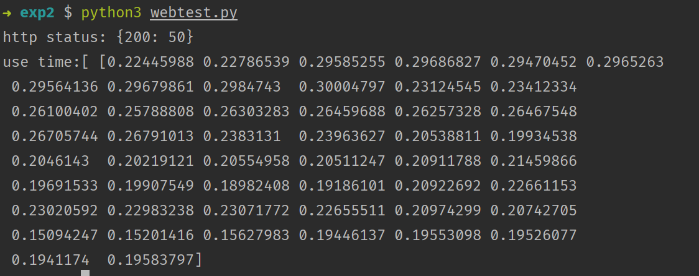
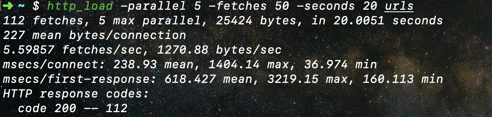

# 操作系统课程设计报告二

### 连浩丞 计算机二班 2017011344

## 题目1

### 思考

- 使用fork函数，在合适的位置开启并行。
- 避免accept函数失败后开启僵尸进程。

### 设计方案

- 在web函数处理请求前开始fork分支。
- 优化主进程，避免僵尸进程。
- 设计压测程序连续进行50次请求，观察web服务器是否支持多进程。

### 源代码

- webserver.c

```c
#include <stdio.h>
#include <stdlib.h>
#include <unistd.h>
#include <errno.h>
#include <string.h>
#include <fcntl.h>
#include <signal.h>
#include <sys/types.h>
#include <sys/time.h>
#include <sys/msg.h>
#include <sys/socket.h>
#include <netinet/in.h>
#include <arpa/inet.h>
#include <time.h>

#define VERSION 23
#define BUFSIZE 8096
#define ERROR 42
#define LOG 44
#define FORBIDDEN 403
#define NOTFOUND 404
#ifndef SIGCLD
#define SIGCLD SIGCHLD
#endif
int fds[2];
struct {
    char *ext;
    char *filetype;
} extensions[] = {
        {"gif",  "image/gif"},
        {"jpg",  "image/jpg"},
        {"jpeg", "image/jpeg"},
        {"png",  "image/png"},
        {"ico",  "image/ico"},
        {"zip",  "image/zip"},
        {"gz",   "image/gz"},
        {"tar",  "image/tar"},
        {"htm",  "text/html"},
        {"html", "text/html"},
        {0,      0}
};

void time_to_str(char*res){
    time_t t;
    time (&t);
    struct tm *lt = localtime(&t);
    sprintf(res, "%4d-%02d-%02d %02d:%02d:%02d\n",lt->tm_year+1900, lt->tm_mon, lt->tm_mday, lt->tm_hour, lt->tm_min, lt->tm_sec);
}

/* 日志函数，将运行过程中的提示信息记录到 webserver.log 文件中*/

void logger(int type, char *s1, char *s2, int socket_fd) {
    int fd;
    char logbuffer[BUFSIZE * 2];
    char TIME[105];
    time_to_str(TIME);
/*根据消息类型，将消息放入 logbuffer 缓存，或直接将消息通过 socket 通道返回给客户端*/
    switch (type) {
        case ERROR:
            (void) sprintf(logbuffer, "ERROR: %s:%s Errno=%d exiting pid=%d", s1, s2, errno, getpid());
            break;
        case FORBIDDEN:
            (void) write(socket_fd,
                         "HTTP/1.1 403 Forbidden\n"
                         "Content-Length: 185\n"
                         "Connection:close\n"
                         "Content-Type: text/html\n\n"
                         "<html><head>\n"
                         "<title>403 Forbidden</title>\n"
                         "</head><body>\n"
                         "<h1>Forbidden</h1>\n"
                         "The requested URL, file type or operationis not allowed on this simple static file webserver.\n"
                         "</body></html>\n",
                         271);
            (void) sprintf(logbuffer, "FORBIDDEN: %s:%s", s1, s2);
            break;
        case NOTFOUND:
            (void) write(socket_fd,
                         "HTTP/1.1 404 Not Found\n"
                         "Content-Length:136\n"
                         "Connection: close\n"
                         "Content-Type: text/html\n\n"
                         "<html><head>\n"
                         "<title>404 Not Found</title>\n"
                         "</head><body>\n"
                         "<h1>Not Found</h1>\n"
                         "The requested URL was not found on this server.\n"
                         "</body></html>\n",
                         224);
            (void) sprintf(logbuffer, "NOT FOUND: %s:%s", s1, s2);
            break;
        case LOG:
            (void) sprintf(logbuffer, " INFO: %s:%s:%d", s1, s2, socket_fd);
            break;
    }
/* 将 logbuffer 缓存中的消息存入 webserver.log 文件*/
    if ((fd = open("webserver.log", O_CREAT | O_WRONLY | O_APPEND, 0644)) >= 0) {
        (void) write(fd, TIME, strlen(TIME));
        (void) write(fd, logbuffer, strlen(logbuffer));
        (void) write(fd, "\n", 1);
        (void) close(fd);
    }
}

/* 此函数完成了 WebServer 主要功能，它首先解析客户端发送的消息，然后从中获取客户端请求的文
件名，然后根据文件名从本地将此文件读入缓存，并生成相应的 HTTP 响应消息；最后通过服务器与客户
端的 socket 通道向客户端返回 HTTP 响应消息*/

void web(int fd, int hit, struct timeval*delay, int *fp) {
    long ret;
    static char buffer[BUFSIZE + 1]; /* 设置静态缓冲区 */
    ret = read(fd, buffer, BUFSIZE);
    if (fork() == 0) {
        struct timeval t1, t2;
        int file_fd, buflen;
        char *fstr;
        long i, j, len;
        double deal, find, post;
        gettimeofday(&t1, NULL);
        /* 从连接通道中读取客户端的请求消息 */
        if (ret == 0 || ret == -1) { //如果读取客户端消息失败，则向客户端发送 HTTP 失败响应信息
            logger(FORBIDDEN, "failed to read browser request", "", fd);
        }
        if (ret > 0 && ret < BUFSIZE)
/* 设置有效字符串，即将字符串尾部表示为 0 */
            buffer[ret] = 0;
        else buffer[0] = 0;
        for (i = 0; i < ret; i++) /* 移除消息字符串中的“CF”和“LF”字符*/
            if (buffer[i] == '\r' || buffer[i] == '\n')
                buffer[i] = '*';
        logger(LOG, "request", buffer, hit);
/*判断客户端 HTTP 请求消息是否为 GET 类型，如果不是则给出相应的响应消息*/
        if (strncmp(buffer, "GET ", 4) && strncmp(buffer, "get ", 4)) {
            logger(FORBIDDEN, "Only simple GET operation supported", buffer, fd);
        }
        for (i = 4; i < BUFSIZE; i++) { /* null terminate after the second space to ignore extra stuff */
            if (buffer[i] == ' ') { /* string is "GET URL " +lots of other stuff */
                buffer[i] = 0;
                break;
            }
        }
        gettimeofday(&t2, NULL);
        deal = (t2.tv_sec - t1.tv_sec) * 1000.0 + (t2.tv_usec - t1.tv_usec) / 1000.0;
        gettimeofday(&t1, NULL);
        for (j = 0; j < i - 1; j++)
/* 在消息中检测路径，不允许路径中出现“.” */
            if (buffer[j] == '.' && buffer[j + 1] == '.') {
                logger(FORBIDDEN, "Parent directory (..) path names not supported", buffer, fd);
            }
        if (!strncmp(&buffer[0], "GET /\0", 6) || !strncmp(&buffer[0], "get /\0", 6))
/* 如果请求消息中没有包含有效的文件名，则使用默认的文件名 index.html */
            (void) strcpy(buffer, "GET /index.html");
/* 根据预定义在 extensions 中的文件类型，检查请求的文件类型是否本服务器支持 */
        buflen = strlen(buffer);
        fstr = (char *) 0;
        for (i = 0; extensions[i].ext != 0; i++) {
            len = strlen(extensions[i].ext);
            if (!strncmp(&buffer[buflen - len], extensions[i].ext, len)) {
                fstr = extensions[i].filetype;
                break;
            }
        }
        if (fstr == 0) logger(FORBIDDEN, "file extension type not supported", buffer, fd);
        gettimeofday(&t2, NULL);
        find = (t2.tv_sec - t1.tv_sec) * 1000.0 + (t2.tv_usec - t1.tv_usec) / 1000.0;
        gettimeofday(&t1, NULL);
        if ((file_fd = open(&buffer[5], O_RDONLY)) == -1) { /* 打开指定的文件名*/
            logger(NOTFOUND, "failed to open file", &buffer[5], fd);
        }
        logger(LOG, "SEND", &buffer[5], hit);
        len = (long) lseek(file_fd, (off_t) 0, SEEK_END); /* 通过 lseek 获取文件长度*/
        (void) lseek(file_fd, (off_t) 0, SEEK_SET); /* 将文件指针移到文件首位置*/
        (void) sprintf(buffer,
                       "HTTP/1.1 200 OK\nServer:nweb/%d.0\nContent-Length:%ld\nConnection:close\nContent-Type: %s\n\n",
                       VERSION, len, fstr); /* Header + a blank line */
        logger(LOG, "Header", buffer, hit);
        (void) write(fd, buffer, strlen(buffer));
/* 不停地从文件里读取文件内容，并通过 socket 通道向客户端返回文件内容*/
        while ((ret = read(file_fd, buffer, BUFSIZE)) > 0) {
            (void) write(fd, buffer, ret);
        }
        select(0, NULL, NULL, NULL, delay);
        close(fd);
        gettimeofday(&t2, NULL);
        //printf("post message, with %.2fms\n", (t2.tv_sec - t1.tv_sec) * 1000.0 + (t2.tv_usec - t1.tv_usec) / 1000.0);
        post = (t2.tv_sec - t1.tv_sec) * 1000.0 + (t2.tv_usec - t1.tv_usec) / 1000.0;
        exit(0);
    }
}

static void del_sig(int sig){
    puts("catch and done!\n");
    exit(0);
}

int main(int argc, char **argv) {
    int i, port, listenfd, socketfd, hit;
    socklen_t length;
    static struct sockaddr_in cli_addr; /* static = initialised to zeros */
    static struct sockaddr_in serv_addr; /* static = initialised to zeros */
/*解析命令参数*/
    if (argc < 3 || argc > 3 || !strcmp(argv[1], "-?")) {
        (void) printf("hint: nweb Port-Number Top-Directory\t\tversion %d\n\n"
                      "\tnweb is a small and very safe mini web server\n"
                      "\tnweb only servers out file/web pages with extensions named below\n"
                      "\t and only from the named directory or its sub-directories.\n"
                      "\tThere is no fancy features = safe and secure.\n\n"
                      "\tExample:webserver 8181 /home/nwebdir &\n\n"
                      "\tOnly Supports:", VERSION);
        for (i = 0; extensions[i].ext != 0; i++)
            (void) printf(" %s", extensions[i].ext);
        (void) printf("\n\tNot Supported: URLs including \"..\", Java, Javascript, CGI\n"
                      "\tNot Supported: directories / /etc /bin /lib /tmp /usr /dev /sbin \n"
                      "\tNo warranty given or implied\n\tNigel Griffiths nag@uk.ibm.com\n");
        exit(0);
    }
    if (!strncmp(argv[2], "/", 2) || !strncmp(argv[2], "/etc", 5) ||
        !strncmp(argv[2], "/bin", 5) || !strncmp(argv[2], "/lib", 5) ||
        !strncmp(argv[2], "/tmp", 5) || !strncmp(argv[2], "/usr", 5) ||
        !strncmp(argv[2], "/dev", 5) || !strncmp(argv[2], "/sbin", 6)) {
        (void) printf("ERROR: Bad top directory %s, see nweb -?\n", argv[2]);
        exit(3);
    }
    if (chdir(argv[2]) == -1) {
        (void) printf("ERROR: Can't Change to directory %s\n", argv[2]);
        exit(4);
    }
/* 建立服务端侦听 socket*/
    if ((listenfd = socket(AF_INET, SOCK_STREAM, 0)) < 0)
        logger(ERROR, "system call", "socket", 0);
    port = atoi(argv[1]);
    if (port < 0 || port > 60000)
        logger(ERROR, "Invalid port number (try 1->60000)", argv[1], 0);
    serv_addr.sin_family = AF_INET;
    serv_addr.sin_addr.s_addr = htonl(INADDR_ANY);
    serv_addr.sin_port = htons(port);
    if (bind(listenfd, (struct sockaddr *) &serv_addr, sizeof(serv_addr)) < 0)
        logger(ERROR, "system call", "bind", 0);
    if (listen(listenfd, 64) < 0)
        logger(ERROR, "system call", "listen", 0);
    struct timeval delay;
    delay.tv_sec = 0;
    delay.tv_usec = 100;
    for (hit = 1;; ++hit) {
       length = sizeof(cli_addr);
       if ((socketfd = accept(listenfd, (struct sockaddr *) &cli_addr, &length)) < 0) {
           logger(ERROR, "system call", "accept", 0);
           continue;
       }
       web(socketfd, hit, &delay); /* never returns */
    }
}
```

webtest.py

```python
#!/usr/bin/env python3
import requests
import threading
from time import perf_counter

status = {}
use_time = []


class http_load(threading.Thread):
    def __init__(self, cnt):
        threading.Thread.__init__(self)
        self.cnt = cnt

    def run(self):
        for i in range(self.cnt):
            start = perf_counter()
            res = requests.get('http://10.3.40.47:9168')
            end = perf_counter()
            mutex.acquire()
            if res.status_code not in status:
                status[res.status_code] = 0
            status[res.status_code] += 1
            use_time.append(end - start)
            mutex.release()


if __name__ == '__main__':
    mutex = threading.Lock()
    tls = []
    for i in range(10):
        tls.append(http_load(5))
        tls[-1].start()
    for i in tls:
        i.join()
    print("http status:", status)
    import numpy as np
    use_time = np.array(use_time)
    print("use time:[", use_time)
```

### 实验过程

- 将服务器上的webserver.c更新，并编译运行。
- 在本机上运行：`python3 webtest.py`

### 运行结果



## 题目2

### 思考

- 利用进程间的管道通信进行更加精确的测量， 并返回结果
- 将子进程的测量结果读取，并计算总时间。

### 设计方案

- 更新webserver.c，编译并运行
- 在本地进行压测，并获取输出。

### 源代码

- webserver.c

```c
#include <stdio.h>
#include <stdlib.h>
#include <unistd.h>
#include <errno.h>
#include <string.h>
#include <fcntl.h>
#include <signal.h>
#include <sys/types.h>
#include <sys/time.h>
#include <sys/msg.h>
#include <sys/socket.h>
#include <netinet/in.h>
#include <arpa/inet.h>
#include <time.h>

#define VERSION 23
#define BUFSIZE 8096
#define ERROR 42
#define LOG 44
#define FORBIDDEN 403
#define NOTFOUND 404
#ifndef SIGCLD
#define SIGCLD SIGCHLD
#endif
int fds[2];
double sum_time = 0;
struct {
    char *ext;
    char *filetype;
} extensions[] = {
        {"gif",  "image/gif"},
        {"jpg",  "image/jpg"},
        {"jpeg", "image/jpeg"},
        {"png",  "image/png"},
        {"ico",  "image/ico"},
        {"zip",  "image/zip"},
        {"gz",   "image/gz"},
        {"tar",  "image/tar"},
        {"htm",  "text/html"},
        {"html", "text/html"},
        {0,      0}
};

void time_to_str(char*res){
    time_t t;
    time (&t);
    struct tm *lt = localtime(&t);
    sprintf(res, "%4d-%02d-%02d %02d:%02d:%02d\n",lt->tm_year+1900, lt->tm_mon, lt->tm_mday, lt->tm_hour, lt->tm_min, lt->tm_sec);
}

/* 日志函数，将运行过程中的提示信息记录到 webserver.log 文件中*/

void logger(int type, char *s1, char *s2, int socket_fd) {
    int fd;
    char logbuffer[BUFSIZE * 2];
    char TIME[105];
    time_to_str(TIME);
/*根据消息类型，将消息放入 logbuffer 缓存，或直接将消息通过 socket 通道返回给客户端*/
    switch (type) {
        case ERROR:
            (void) sprintf(logbuffer, "ERROR: %s:%s Errno=%d exiting pid=%d", s1, s2, errno, getpid());
            break;
        case FORBIDDEN:
            (void) write(socket_fd,
                         "HTTP/1.1 403 Forbidden\n"
                         "Content-Length: 185\n"
                         "Connection:close\n"
                         "Content-Type: text/html\n\n"
                         "<html><head>\n"
                         "<title>403 Forbidden</title>\n"
                         "</head><body>\n"
                         "<h1>Forbidden</h1>\n"
                         "The requested URL, file type or operationis not allowed on this simple static file webserver.\n"
                         "</body></html>\n",
                         271);
            (void) sprintf(logbuffer, "FORBIDDEN: %s:%s", s1, s2);
            break;
        case NOTFOUND:
            (void) write(socket_fd,
                         "HTTP/1.1 404 Not Found\n"
                         "Content-Length:136\n"
                         "Connection: close\n"
                         "Content-Type: text/html\n\n"
                         "<html><head>\n"
                         "<title>404 Not Found</title>\n"
                         "</head><body>\n"
                         "<h1>Not Found</h1>\n"
                         "The requested URL was not found on this server.\n"
                         "</body></html>\n",
                         224);
            (void) sprintf(logbuffer, "NOT FOUND: %s:%s", s1, s2);
            break;
        case LOG:
            (void) sprintf(logbuffer, " INFO: %s:%s:%d", s1, s2, socket_fd);
            break;
    }
/* 将 logbuffer 缓存中的消息存入 webserver.log 文件*/
    if ((fd = open("webserver.log", O_CREAT | O_WRONLY | O_APPEND, 0644)) >= 0) {
        (void) write(fd, TIME, strlen(TIME));
        (void) write(fd, logbuffer, strlen(logbuffer));
        (void) write(fd, "\n", 1);
        (void) close(fd);
    }
}

/* 此函数完成了 WebServer 主要功能，它首先解析客户端发送的消息，然后从中获取客户端请求的文
件名，然后根据文件名从本地将此文件读入缓存，并生成相应的 HTTP 响应消息；最后通过服务器与客户
端的 socket 通道向客户端返回 HTTP 响应消息*/

void web(int fd, int hit, struct timeval*delay, int *fp) {
    long ret;
    static char buffer[BUFSIZE + 1]; /* 设置静态缓冲区 */
    ret = read(fd, buffer, BUFSIZE);
    if (fork() == 0) {
        struct timeval t1, t2;
        int file_fd, buflen;
        char *fstr;
        long i, j, len;
        double deal, find, post;
        gettimeofday(&t1, NULL);
        /* 从连接通道中读取客户端的请求消息 */
        if (ret == 0 || ret == -1) { //如果读取客户端消息失败，则向客户端发送 HTTP 失败响应信息
            logger(FORBIDDEN, "failed to read browser request", "", fd);
        }
        if (ret > 0 && ret < BUFSIZE)
/* 设置有效字符串，即将字符串尾部表示为 0 */
            buffer[ret] = 0;
        else buffer[0] = 0;
        for (i = 0; i < ret; i++) /* 移除消息字符串中的“CF”和“LF”字符*/
            if (buffer[i] == '\r' || buffer[i] == '\n')
                buffer[i] = '*';
        logger(LOG, "request", buffer, hit);
/*判断客户端 HTTP 请求消息是否为 GET 类型，如果不是则给出相应的响应消息*/
        if (strncmp(buffer, "GET ", 4) && strncmp(buffer, "get ", 4)) {
            logger(FORBIDDEN, "Only simple GET operation supported", buffer, fd);
        }
        for (i = 4; i < BUFSIZE; i++) { /* null terminate after the second space to ignore extra stuff */
            if (buffer[i] == ' ') { /* string is "GET URL " +lots of other stuff */
                buffer[i] = 0;
                break;
            }
        }
        gettimeofday(&t2, NULL);
        deal = (t2.tv_sec - t1.tv_sec) * 1000.0 + (t2.tv_usec - t1.tv_usec) / 1000.0;
        gettimeofday(&t1, NULL);
        for (j = 0; j < i - 1; j++)
/* 在消息中检测路径，不允许路径中出现“.” */
            if (buffer[j] == '.' && buffer[j + 1] == '.') {
                logger(FORBIDDEN, "Parent directory (..) path names not supported", buffer, fd);
            }
        if (!strncmp(&buffer[0], "GET /\0", 6) || !strncmp(&buffer[0], "get /\0", 6))
/* 如果请求消息中没有包含有效的文件名，则使用默认的文件名 index.html */
            (void) strcpy(buffer, "GET /index.html");
/* 根据预定义在 extensions 中的文件类型，检查请求的文件类型是否本服务器支持 */
        buflen = strlen(buffer);
        fstr = (char *) 0;
        for (i = 0; extensions[i].ext != 0; i++) {
            len = strlen(extensions[i].ext);
            if (!strncmp(&buffer[buflen - len], extensions[i].ext, len)) {
                fstr = extensions[i].filetype;
                break;
            }
        }
        if (fstr == 0) logger(FORBIDDEN, "file extension type not supported", buffer, fd);
        gettimeofday(&t2, NULL);
        find = (t2.tv_sec - t1.tv_sec) * 1000.0 + (t2.tv_usec - t1.tv_usec) / 1000.0;
        gettimeofday(&t1, NULL);
        if ((file_fd = open(&buffer[5], O_RDONLY)) == -1) { /* 打开指定的文件名*/
            logger(NOTFOUND, "failed to open file", &buffer[5], fd);
        }
        logger(LOG, "SEND", &buffer[5], hit);
        len = (long) lseek(file_fd, (off_t) 0, SEEK_END); /* 通过 lseek 获取文件长度*/
        (void) lseek(file_fd, (off_t) 0, SEEK_SET); /* 将文件指针移到文件首位置*/
        (void) sprintf(buffer,
                       "HTTP/1.1 200 OK\nServer:nweb/%d.0\nContent-Length:%ld\nConnection:close\nContent-Type: %s\n\n",
                       VERSION, len, fstr); /* Header + a blank line */
        logger(LOG, "Header", buffer, hit);
        (void) write(fd, buffer, strlen(buffer));
/* 不停地从文件里读取文件内容，并通过 socket 通道向客户端返回文件内容*/
        while ((ret = read(file_fd, buffer, BUFSIZE)) > 0) {
            (void) write(fd, buffer, ret);
        }
        select(0, NULL, NULL, NULL, delay);
        close(fd);
        gettimeofday(&t2, NULL);
        //printf("post message, with %.2fms\n", (t2.tv_sec - t1.tv_sec) * 1000.0 + (t2.tv_usec - t1.tv_usec) / 1000.0);
        post = (t2.tv_sec - t1.tv_sec) * 1000.0 + (t2.tv_usec - t1.tv_usec) / 1000.0;
        printf("inq_msg{pid: %d, deal: %.2f, find: %.2f, post: %.2f}\n", getpid(), deal, find, post);
        char ret_val[105];
        sprintf(ret_val, "%d %f %f %f", getpid(), deal, find, post);
        write(fp[1], ret_val, 105);
        exit(0);
    }
}

static void del_sig(int sig){
    puts("catch and done!\n");
    printf("Total use time: %lf ms\n" ,sum_time);
    exit(0);
}

int main(int argc, char **argv) {
    int i, port, listenfd, socketfd, hit;
    socklen_t length;
    static struct sockaddr_in cli_addr; /* static = initialised to zeros */
    static struct sockaddr_in serv_addr; /* static = initialised to zeros */
/*解析命令参数*/
    if (argc < 3 || argc > 3 || !strcmp(argv[1], "-?")) {
        (void) printf("hint: nweb Port-Number Top-Directory\t\tversion %d\n\n"
                      "\tnweb is a small and very safe mini web server\n"
                      "\tnweb only servers out file/web pages with extensions named below\n"
                      "\t and only from the named directory or its sub-directories.\n"
                      "\tThere is no fancy features = safe and secure.\n\n"
                      "\tExample:webserver 8181 /home/nwebdir &\n\n"
                      "\tOnly Supports:", VERSION);
        for (i = 0; extensions[i].ext != 0; i++)
            (void) printf(" %s", extensions[i].ext);
        (void) printf("\n\tNot Supported: URLs including \"..\", Java, Javascript, CGI\n"
                      "\tNot Supported: directories / /etc /bin /lib /tmp /usr /dev /sbin \n"
                      "\tNo warranty given or implied\n\tNigel Griffiths nag@uk.ibm.com\n");
        exit(0);
    }
    if (!strncmp(argv[2], "/", 2) || !strncmp(argv[2], "/etc", 5) ||
        !strncmp(argv[2], "/bin", 5) || !strncmp(argv[2], "/lib", 5) ||
        !strncmp(argv[2], "/tmp", 5) || !strncmp(argv[2], "/usr", 5) ||
        !strncmp(argv[2], "/dev", 5) || !strncmp(argv[2], "/sbin", 6)) {
        (void) printf("ERROR: Bad top directory %s, see nweb -?\n", argv[2]);
        exit(3);
    }
    if (chdir(argv[2]) == -1) {
        (void) printf("ERROR: Can't Change to directory %s\n", argv[2]);
        exit(4);
    }
/* 建立服务端侦听 socket*/
    if ((listenfd = socket(AF_INET, SOCK_STREAM, 0)) < 0)
        logger(ERROR, "system call", "socket", 0);
    port = atoi(argv[1]);
    if (port < 0 || port > 60000)
        logger(ERROR, "Invalid port number (try 1->60000)", argv[1], 0);
    serv_addr.sin_family = AF_INET;
    serv_addr.sin_addr.s_addr = htonl(INADDR_ANY);
    serv_addr.sin_port = htons(port);
    if (bind(listenfd, (struct sockaddr *) &serv_addr, sizeof(serv_addr)) < 0)
        logger(ERROR, "system call", "bind", 0);
    if (listen(listenfd, 64) < 0)
        logger(ERROR, "system call", "listen", 0);
    struct timeval delay;
    delay.tv_sec = 0;
    delay.tv_usec = 100;
    pipe(fds);
    if (fork() == 0) {
        char info[105];
        pid_t pid;
        double deal, find, post;
        signal(SIGINT, del_sig);
        printf("listener pid: %d\n", getpid());
        while (1) {
            read(fds[0], info, 105);
            sscanf(info, "%d%lf%lf%lf", &pid, &deal, &find, &post);
            sum_time += deal + find + post;
            printf("top_msg{pid: %d, deal: %.2f, find: %.2f, post: %.2f}\n", pid, deal, find, post);
        }
    } else {
        for (hit = 1;; ++hit) {
            length = sizeof(cli_addr);
            if ((socketfd = accept(listenfd, (struct sockaddr *) &cli_addr, &length)) < 0) {
                logger(ERROR, "system call", "accept", 0);
                continue;
            }
            web(socketfd, hit, &delay, fds); /* never returns */
        }
    }
}
```

### 实验过程

- 更新webserver，并运行`run -br 9168 ./frontend` (关于run命令请查看：https://pypi.org/project/Qpro/)
- 在本地运行：`python3 webtest.py`

### 运行结果

- Webserver输出：

  ```text
  inq_msg{pid: 1463, deal: 0.40, find: 0.01, post: 0.32}
  inq_msg{pid: 1464, deal: 0.44, find: 0.01, post: 0.29}
  inq_msg{pid: 1465, deal: 0.37, find: 0.01, post: 0.32}
  inq_msg{pid: 1466, deal: 0.39, find: 0.01, post: 0.31}
  inq_msg{pid: 1467, deal: 0.38, find: 0.01, post: 0.39}
  inq_msg{pid: 1468, deal: 0.39, find: 0.01, post: 0.35}
  inq_msg{pid: 1469, deal: 0.43, find: 0.01, post: 0.31}
  inq_msg{pid: 1471, deal: 0.34, find: 0.01, post: 0.32}
  inq_msg{pid: 1472, deal: 0.40, find: 0.01, post: 0.35}
  inq_msg{pid: 1473, deal: 0.37, find: 0.01, post: 0.28}
  inq_msg{pid: 1474, deal: 0.33, find: 0.01, post: 0.28}
  inq_msg{pid: 1475, deal: 0.35, find: 0.01, post: 0.32}
  inq_msg{pid: 1476, deal: 0.35, find: 0.01, post: 0.28}
  inq_msg{pid: 1477, deal: 0.35, find: 0.01, post: 0.32}
  inq_msg{pid: 1479, deal: 0.35, find: 0.01, post: 0.28}
  inq_msg{pid: 1478, deal: 0.39, find: 0.01, post: 0.35}
  inq_msg{pid: 1482, deal: 0.73, find: 0.01, post: 0.31}
  inq_msg{pid: 1483, deal: 0.35, find: 0.01, post: 0.27}
  inq_msg{pid: 1484, deal: 0.38, find: 0.01, post: 0.30}
  inq_msg{pid: 1485, deal: 0.38, find: 0.01, post: 0.31}
  inq_msg{pid: 1486, deal: 0.37, find: 0.01, post: 0.31}
  inq_msg{pid: 1487, deal: 0.36, find: 0.01, post: 0.28}
  inq_msg{pid: 1488, deal: 0.36, find: 0.01, post: 0.28}
  inq_msg{pid: 1489, deal: 0.36, find: 0.01, post: 0.30}
  inq_msg{pid: 1490, deal: 0.36, find: 0.01, post: 0.33}
  inq_msg{pid: 1491, deal: 0.39, find: 0.01, post: 0.31}
  inq_msg{pid: 1492, deal: 0.36, find: 0.01, post: 0.28}
  inq_msg{pid: 1493, deal: 0.34, find: 0.01, post: 0.28}
  inq_msg{pid: 1494, deal: 0.35, find: 0.01, post: 0.27}
  inq_msg{pid: 1495, deal: 0.35, find: 0.01, post: 0.31}
  inq_msg{pid: 1496, deal: 0.37, find: 0.01, post: 0.29}
  inq_msg{pid: 1497, deal: 0.37, find: 0.01, post: 0.31}
  inq_msg{pid: 1498, deal: 0.37, find: 0.01, post: 0.32}
  inq_msg{pid: 1499, deal: 0.36, find: 0.01, post: 0.31}
  inq_msg{pid: 1500, deal: 0.37, find: 0.01, post: 0.30}
  inq_msg{pid: 1501, deal: 0.37, find: 0.01, post: 0.28}
  inq_msg{pid: 1502, deal: 0.36, find: 0.01, post: 0.28}
  inq_msg{pid: 1503, deal: 0.34, find: 0.01, post: 0.28}
  inq_msg{pid: 1504, deal: 0.33, find: 0.01, post: 0.28}
  inq_msg{pid: 1505, deal: 0.33, find: 0.01, post: 0.26}
  inq_msg{pid: 1506, deal: 0.33, find: 0.00, post: 0.28}
  inq_msg{pid: 1507, deal: 0.34, find: 0.01, post: 0.28}
  inq_msg{pid: 1508, deal: 0.30, find: 0.01, post: 0.29}
  inq_msg{pid: 1509, deal: 0.36, find: 0.01, post: 0.28}
  inq_msg{pid: 1510, deal: 0.37, find: 0.01, post: 0.29}
  inq_msg{pid: 1511, deal: 0.35, find: 0.01, post: 0.28}
  inq_msg{pid: 1512, deal: 0.34, find: 0.01, post: 0.28}
  listener pid: 1455
  top_msg{pid: 1463, deal: 0.40, find: 0.01, post: 0.32}
  top_msg{pid: 1464, deal: 0.44, find: 0.01, post: 0.29}
  top_msg{pid: 1465, deal: 0.37, find: 0.01, post: 0.32}
  top_msg{pid: 1466, deal: 0.39, find: 0.01, post: 0.31}
  top_msg{pid: 1467, deal: 0.38, find: 0.01, post: 0.39}
  top_msg{pid: 1468, deal: 0.39, find: 0.01, post: 0.35}
  top_msg{pid: 1469, deal: 0.43, find: 0.01, post: 0.31}
  top_msg{pid: 1470, deal: 0.36, find: 0.01, post: 0.32}
  top_msg{pid: 1471, deal: 0.34, find: 0.01, post: 0.32}
  top_msg{pid: 1472, deal: 0.40, find: 0.01, post: 0.35}
  top_msg{pid: 1473, deal: 0.37, find: 0.01, post: 0.28}
  top_msg{pid: 1474, deal: 0.33, find: 0.01, post: 0.28}
  top_msg{pid: 1475, deal: 0.35, find: 0.01, post: 0.32}
  top_msg{pid: 1476, deal: 0.35, find: 0.01, post: 0.28}
  top_msg{pid: 1477, deal: 0.35, find: 0.01, post: 0.32}
  top_msg{pid: 1479, deal: 0.35, find: 0.01, post: 0.28}
  top_msg{pid: 1478, deal: 0.39, find: 0.01, post: 0.35}
  top_msg{pid: 1481, deal: 0.81, find: 0.00, post: 0.32}
  top_msg{pid: 1480, deal: 0.36, find: 0.01, post: 0.85}
  top_msg{pid: 1482, deal: 0.73, find: 0.01, post: 0.31}
  top_msg{pid: 1483, deal: 0.35, find: 0.01, post: 0.27}
  top_msg{pid: 1484, deal: 0.38, find: 0.01, post: 0.30}
  top_msg{pid: 1485, deal: 0.38, find: 0.01, post: 0.31}
  top_msg{pid: 1486, deal: 0.37, find: 0.01, post: 0.31}
  top_msg{pid: 1487, deal: 0.36, find: 0.01, post: 0.28}
  top_msg{pid: 1488, deal: 0.36, find: 0.01, post: 0.28}
  top_msg{pid: 1489, deal: 0.36, find: 0.01, post: 0.30}
  top_msg{pid: 1490, deal: 0.36, find: 0.01, post: 0.33}
  top_msg{pid: 1491, deal: 0.39, find: 0.01, post: 0.31}
  top_msg{pid: 1492, deal: 0.36, find: 0.01, post: 0.28}
  top_msg{pid: 1493, deal: 0.34, find: 0.01, post: 0.28}
  top_msg{pid: 1494, deal: 0.35, find: 0.01, post: 0.27}
  top_msg{pid: 1495, deal: 0.35, find: 0.01, post: 0.31}
  top_msg{pid: 1496, deal: 0.37, find: 0.01, post: 0.29}
  top_msg{pid: 1497, deal: 0.37, find: 0.01, post: 0.31}
  top_msg{pid: 1498, deal: 0.37, find: 0.01, post: 0.32}
  top_msg{pid: 1499, deal: 0.36, find: 0.01, post: 0.31}
  top_msg{pid: 1500, deal: 0.37, find: 0.01, post: 0.30}
  top_msg{pid: 1501, deal: 0.37, find: 0.01, post: 0.28}
  top_msg{pid: 1502, deal: 0.36, find: 0.01, post: 0.28}
  top_msg{pid: 1503, deal: 0.34, find: 0.01, post: 0.28}
  top_msg{pid: 1504, deal: 0.33, find: 0.01, post: 0.28}
  top_msg{pid: 1505, deal: 0.33, find: 0.01, post: 0.26}
  top_msg{pid: 1506, deal: 0.33, find: 0.00, post: 0.28}
  top_msg{pid: 1507, deal: 0.34, find: 0.01, post: 0.28}
  top_msg{pid: 1508, deal: 0.30, find: 0.01, post: 0.29}
  top_msg{pid: 1509, deal: 0.36, find: 0.01, post: 0.28}
  top_msg{pid: 1510, deal: 0.37, find: 0.01, post: 0.29}
  top_msg{pid: 1511, deal: 0.35, find: 0.01, post: 0.28}
  top_msg{pid: 1512, deal: 0.34, find: 0.01, post: 0.28}
  catch and done!
  
  Total use time: 34.822000 ms
  ```

- 本地输出:

  ```text
  http status: {200: 50}
  use time:[ [0.25529558 0.26219874 0.25915939 0.25423102 0.26487696 0.25686534
   0.26772369 0.26082976 0.26284206 0.27185691 0.24559699 0.2828645
   0.31196892 0.31170084 0.31182949 0.31794453 0.31754514 0.31151702
   0.32084603 0.32086082 0.20717775 0.21995116 0.18920572 0.1907161
   0.1929321  0.22224278 0.22540328 0.23636382 0.23726062 0.24679065
   0.17531631 0.15752347 0.16684871 0.19403733 0.15385874 0.2042116
   0.16601434 0.16458019 0.15427595 0.1505989  0.16468284 0.22307192
   0.19413174 0.22588753 0.23949091 0.24128572 0.23959551 0.24192829
   0.23822109 0.24056802]
  ```

## 题目3

### 设计方案

- 使用http_load进行压测，观察结果并分析。

### 运行结果



### 现象分析

- 原因：由于服务器开启并行处理http请求，解析和发送数据都可以交给子进程来做，主进程只需要不断生成子进程处理单个http请求即可，节省了大量的时间。
- 瓶颈：并行下的服务进程受服务器并发能力影响，也和处理一次http请求的算法效率影响。在高并发下，主进程反复开启新进程，会让进程效率低下。多个进程的管道通信，也会降低服务器性能。
- 还能提高性能。

