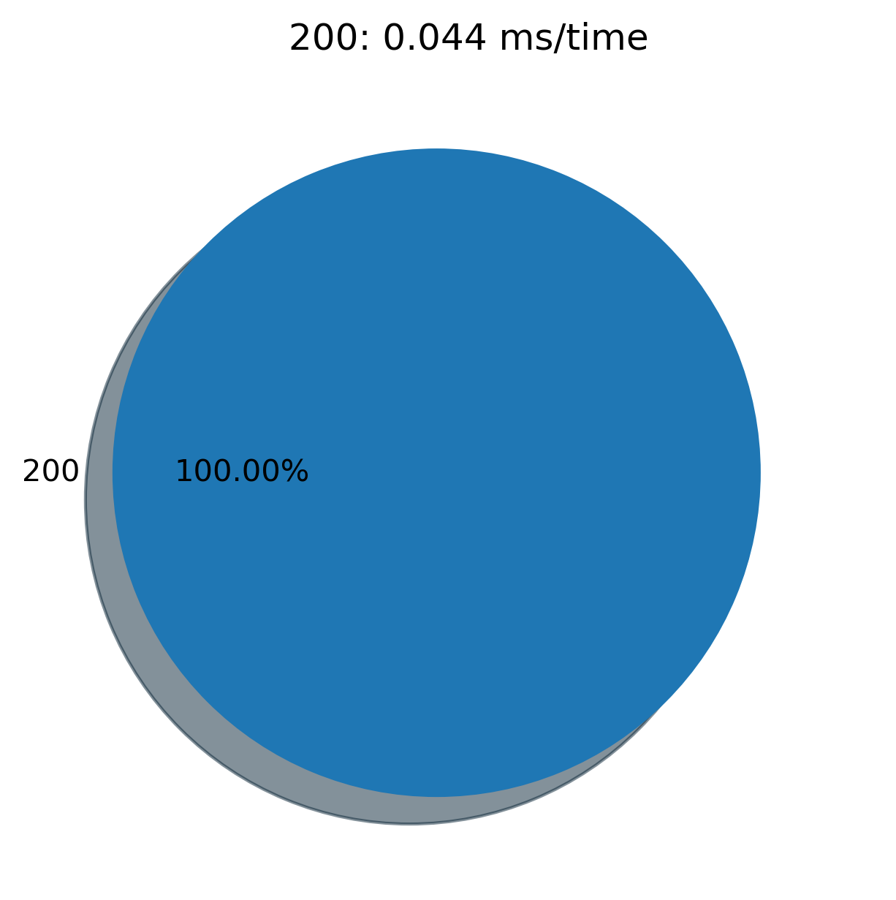
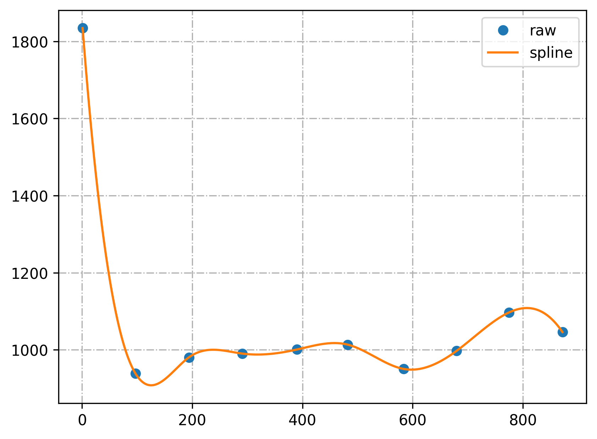

# 操作系统课程设计报告四

### 连浩丞 计算机二班 2017011344

##一、独立完成线程池数据结构及相关算法

线程池：

- thpool.h

```c
#ifndef _THPOOL_
#define _THPOOL_

typedef struct thpool_* threadpool;
threadpool thpool_init(int num_threads);
int thpool_add_work(threadpool, void (*function_p)(void*), void* arg_p);
void thpool_wait(threadpool);
void thpool_pause(threadpool);
void thpool_resume(threadpool);
void thpool_destroy(threadpool);
int thpool_num_threads_working(threadpool);

#endif
```

- thpool.c

```c
#include <unistd.h>
#include <signal.h>
#include <stdio.h>
#include <stdlib.h>
#include <pthread.h>
#include <errno.h>
#include <time.h>
#if defined(__linux__)
#include <sys/prctl.h>
#endif

#include "thpool.h"

#if !defined(DISABLE_PRINT)
#define err(str) fprintf(stderr, str)
#else
#define err(str)
#endif

static volatile int threads_keepalive;
static volatile int threads_on_hold;

typedef struct {
	pthread_mutex_t mutex;
	pthread_cond_t   cond;
	int v;
} bsem;

typedef struct {
	struct job*  prev;                   /* pointer to previous job   */
	void   (*function)(void* arg);       /* function pointer          */
	void*  arg;                          /* function's argument       */
} job;

typedef struct {
	pthread_mutex_t rwmutex;             /* used for queue r/w access */
	job  *front;                         /* pointer to front of queue */
	job  *rear;                          /* pointer to rear  of queue */
	bsem *has_jobs;                      /* flag as binary semaphore  */
	int   len;                           /* number of jobs in queue   */
} jobqueue;

typedef struct {
	int       id;                        /* friendly id               */
	pthread_t pthread;                   /* pointer to actual thread  */
	struct thpool_* thpool_p;            /* access to thpool          */
} thread;

typedef struct {
	thread**   threads;                  /* pointer to threads        */
	volatile int num_threads_alive;      /* threads currently alive   */
	volatile int num_threads_working;    /* threads currently working */
	pthread_mutex_t  thcount_lock;       /* used for thread count etc */
	pthread_cond_t  threads_all_idle;    /* signal to thpool_wait     */
	jobqueue  jobqueue;                  /* job queue                 */
} thpool_;

static int  thread_init(thpool_* thpool_p, struct thread** thread_p, int id);
static void* thread_do(struct thread* thread_p);
static void  thread_hold(int sig_id);
static void  thread_destroy(struct thread* thread_p);

static int   jobqueue_init(jobqueue* jobqueue_p);
static void  jobqueue_clear(jobqueue* jobqueue_p);
static void  jobqueue_push(jobqueue* jobqueue_p, struct job* newjob_p);
static struct job* jobqueue_pull(jobqueue* jobqueue_p);
static void  jobqueue_destroy(jobqueue* jobqueue_p);

static void  bsem_init(struct bsem *bsem_p, int value);
static void  bsem_reset(struct bsem *bsem_p);
static void  bsem_post(struct bsem *bsem_p);
static void  bsem_post_all(struct bsem *bsem_p);
static void  bsem_wait(struct bsem *bsem_p);

struct thpool_* thpool_init(int num_threads){
	threads_on_hold   = 0;
	threads_keepalive = 1;

	if (num_threads < 0)num_threads = 0;
	thpool_* thpool_p;
	thpool_p = (struct thpool_*)malloc(sizeof(struct thpool_));
	if (thpool_p == NULL){
		err("thpool_init(): Could not allocate memory for thread pool\n");
		return NULL;
	}
	thpool_p->num_threads_alive   = 0;
	thpool_p->num_threads_working = 0;

	if (jobqueue_init(&thpool_p->jobqueue) == -1){
		err("thpool_init(): Could not allocate memory for job queue\n");
		free(thpool_p);
		return NULL;
	}

	thpool_p->threads = (struct thread**)malloc(num_threads * sizeof(struct thread *));
	if (thpool_p->threads == NULL){
		err("thpool_init(): Could not allocate memory for threads\n");
		jobqueue_destroy(&thpool_p->jobqueue);
		free(thpool_p);
		return NULL;
	}

	pthread_mutex_init(&(thpool_p->thcount_lock), NULL);
	pthread_cond_init(&thpool_p->threads_all_idle, NULL);

	int n;
	for (n=0; n<num_threads; n++){
		thread_init(thpool_p, &thpool_p->threads[n], n);
	}

	/* Wait for threads to initialize */
	while (thpool_p->num_threads_alive != num_threads) {}

	return thpool_p;
}


/* Add work to the thread pool */
int thpool_add_work(thpool_* thpool_p, void (*function_p)(void*), void* arg_p){
	job* newjob;

	newjob=(struct job*)malloc(sizeof(struct job));
	if (newjob==NULL){
		err("thpool_add_work(): Could not allocate memory for new job\n");
		return -1;
	}

	/* add function and argument */
	newjob->function=function_p;
	newjob->arg=arg_p;

	/* add job to queue */
	jobqueue_push(&thpool_p->jobqueue, newjob);

	return 0;
}


/* Wait until all jobs have finished */
void thpool_wait(thpool_* thpool_p){
	pthread_mutex_lock(&thpool_p->thcount_lock);
	while (thpool_p->jobqueue.len || thpool_p->num_threads_working) {
		pthread_cond_wait(&thpool_p->threads_all_idle, &thpool_p->thcount_lock);
	}
	pthread_mutex_unlock(&thpool_p->thcount_lock);
}


/// Destroy the threadpool
void thpool_destroy(thpool_* thpool_p){
	/// No need to destory if it's NULL */
	if (thpool_p == NULL) return ;

	volatile int threads_total = thpool_p->num_threads_alive;

	/// End each thread 's infinite loop 
	threads_keepalive = 0;

	/// Give one second to kill idle threads 
	double TIMEOUT = 1.0;
	time_t start, end;
	double tpassed = 0.0;
	time (&start);
	while (tpassed < TIMEOUT && thpool_p->num_threads_alive){
		bsem_post_all(thpool_p->jobqueue.has_jobs);
		time (&end);
		tpassed = difftime(end,start);
	}

	/// Poll remaining threads 
	while (thpool_p->num_threads_alive){
		bsem_post_all(thpool_p->jobqueue.has_jobs);
		sleep(1);
	}

	/// Job queue cleanup
	jobqueue_destroy(&thpool_p->jobqueue);
	/// Deallocs
	int n;
	for (n=0; n < threads_total; n++){
		thread_destroy(thpool_p->threads[n]);
	}
	free(thpool_p->threads);
	free(thpool_p);
}


/// Pause all threads in threadpool
void thpool_pause(thpool_* thpool_p) {
	int n;
	for (n=0; n < thpool_p->num_threads_alive; n++){
		pthread_kill(thpool_p->threads[n]->pthread, SIGUSR1);
	}
}

void thpool_resume(thpool_* thpool_p) {
    (void)thpool_p;
	threads_on_hold = 0;
}

int thpool_num_threads_working(thpool_* thpool_p){
	return thpool_p->num_threads_working;
}

static int thread_init (thpool_* thpool_p, struct thread** thread_p, int id){
	*thread_p = (struct thread*)malloc(sizeof(struct thread));
	if (*thread_p == NULL){
		err("thread_init(): Could not allocate memory for thread\n");
		return -1;
	}
	(*thread_p)->thpool_p = thpool_p;
	(*thread_p)->id       = id;
	pthread_create(&(*thread_p)->pthread, NULL, (void *)thread_do, (*thread_p));
	pthread_detach((*thread_p)->pthread);
	return 0;
}

static void thread_hold(int sig_id) {
    (void)sig_id;
	threads_on_hold = 1;
	while (threads_on_hold){
		sleep(1);
	}
}

static void* thread_do(struct thread* thread_p){
	char thread_name[128] = {0};
	sprintf(thread_name, "thread-pool-%d", thread_p->id);

#if defined(__linux__)
	/// Use prctl instead to prevent using _GNU_SOURCE flag and implicit declaration
	prctl(PR_SET_NAME, thread_name);
#elif defined(__APPLE__) && defined(__MACH__)
	pthread_setname_np(thread_name);
#else
	err("thread_do(): pthread_setname_np is not supported on this system");
#endif

	/// Assure all threads have been created before starting serving
	thpool_* thpool_p = thread_p->thpool_p;

	/// Register signal handler
	struct sigaction act;
	sigemptyset(&act.sa_mask);
	act.sa_flags = 0;
	act.sa_handler = thread_hold;
	if (sigaction(SIGUSR1, &act, NULL) == -1) {
		err("thread_do(): cannot handle SIGUSR1");
	}

	/// Mark thread as alive (initialized)
	pthread_mutex_lock(&thpool_p->thcount_lock);
	thpool_p->num_threads_alive += 1;
	pthread_mutex_unlock(&thpool_p->thcount_lock);

	while(threads_keepalive){

		bsem_wait(thpool_p->jobqueue.has_jobs);

		if (threads_keepalive){

			pthread_mutex_lock(&thpool_p->thcount_lock);
			thpool_p->num_threads_working++;
			pthread_mutex_unlock(&thpool_p->thcount_lock);

			/// Read job from queue and execute it
			void (*func_buff)(void*);
			void*  arg_buff;
			job* job_p = jobqueue_pull(&thpool_p->jobqueue);
			if (job_p) {
				func_buff = job_p->function;
				arg_buff  = job_p->arg;
				func_buff(arg_buff);
				free(job_p);
			}

			pthread_mutex_lock(&thpool_p->thcount_lock);
			thpool_p->num_threads_working--;
			if (!thpool_p->num_threads_working) {
				pthread_cond_signal(&thpool_p->threads_all_idle);
			}
			pthread_mutex_unlock(&thpool_p->thcount_lock);

		}
	}
	pthread_mutex_lock(&thpool_p->thcount_lock);
	thpool_p->num_threads_alive --;
	pthread_mutex_unlock(&thpool_p->thcount_lock);

	return NULL;
}

static void thread_destroy (thread* thread_p){
	free(thread_p);
}

static int jobqueue_init(jobqueue* jobqueue_p){
	jobqueue_p->len = 0;
	jobqueue_p->front = NULL;
	jobqueue_p->rear  = NULL;

	jobqueue_p->has_jobs = (struct bsem*)malloc(sizeof(struct bsem));
	if (jobqueue_p->has_jobs == NULL){
		return -1;
	}

	pthread_mutex_init(&(jobqueue_p->rwmutex), NULL);
	bsem_init(jobqueue_p->has_jobs, 0);

	return 0;
}

static void jobqueue_clear(jobqueue* jobqueue_p){

	while(jobqueue_p->len){
		free(jobqueue_pull(jobqueue_p));
	}

	jobqueue_p->front = NULL;
	jobqueue_p->rear  = NULL;
	bsem_reset(jobqueue_p->has_jobs);
	jobqueue_p->len = 0;

}

static void jobqueue_push(jobqueue* jobqueue_p, struct job* newjob){

	pthread_mutex_lock(&jobqueue_p->rwmutex);
	newjob->prev = NULL;

	switch(jobqueue_p->len){
		case 0:
					jobqueue_p->front = newjob;
					jobqueue_p->rear  = newjob;
					break;

		default:
					jobqueue_p->rear->prev = newjob;
					jobqueue_p->rear = newjob;

	}
	jobqueue_p->len++;

	bsem_post(jobqueue_p->has_jobs);
	pthread_mutex_unlock(&jobqueue_p->rwmutex);
}

static struct job* jobqueue_pull(jobqueue* jobqueue_p){

	pthread_mutex_lock(&jobqueue_p->rwmutex);
	job* job_p = jobqueue_p->front;

	switch(jobqueue_p->len){

		case 0:
		  			break;

		case 1:
					jobqueue_p->front = NULL;
					jobqueue_p->rear  = NULL;
					jobqueue_p->len = 0;
					break;

		default:
					jobqueue_p->front = job_p->prev;
					jobqueue_p->len--;
					bsem_post(jobqueue_p->has_jobs);
	}

	pthread_mutex_unlock(&jobqueue_p->rwmutex);
	return job_p;
}


/* Free all queue resources back to the system */
static void jobqueue_destroy(jobqueue* jobqueue_p){
	jobqueue_clear(jobqueue_p);
	free(jobqueue_p->has_jobs);
}

static void bsem_init(bsem *bsem_p, int value) {
	if (value < 0 || value > 1) {
		err("bsem_init(): Binary semaphore can take only values 1 or 0");
		exit(1);
	}
	pthread_mutex_init(&(bsem_p->mutex), NULL);
	pthread_cond_init(&(bsem_p->cond), NULL);
	bsem_p->v = value;
}

static void bsem_reset(bsem *bsem_p) {
	bsem_init(bsem_p, 0);
}

static void bsem_post(bsem *bsem_p) {
	pthread_mutex_lock(&bsem_p->mutex);
	bsem_p->v = 1;
	pthread_cond_signal(&bsem_p->cond);
	pthread_mutex_unlock(&bsem_p->mutex);
}

static void bsem_post_all(bsem *bsem_p) {
	pthread_mutex_lock(&bsem_p->mutex);
	bsem_p->v = 1;
	pthread_cond_broadcast(&bsem_p->cond);
	pthread_mutex_unlock(&bsem_p->mutex);
}

static void bsem_wait(bsem* bsem_p) {
	pthread_mutex_lock(&bsem_p->mutex);
	while (bsem_p->v != 1) {
		pthread_cond_wait(&bsem_p->cond, &bsem_p->mutex);
	}
	bsem_p->v = 0;
	pthread_mutex_unlock(&bsem_p->mutex);
}
```

## 题目4

### 设计方案

- 将多线程模型用线程池模型代替
- 测试效果

### 源代码

- 修改webserver.c的主函数后部：

```c
#include "thpool.h"
// ...
threadpool pool;
// ...

static void del_sig(int sig){
    thpool_destroy(pool);
    puts("\n");
    printf("Total requests:\t%u\n", total);
    printf("Total write log:\t%u\n", tol_log);
    printf("read socket:\t%4.2fms/time\n", read_soc / total);
    printf("read web:\t%4.2fms/time\n", read_web / total);
    printf("post data:\t%4.2fms/time\n", post_dt / total);
    printf("write log:\t%4.2fms/time\n", write_log / tol_log);
    exit(0);
}

int main(int argc, char **argv) {
    // ...
	  signal(SIGINT, del_sig);
    pool = thpool_init(128);
    for (hit = 1;; ++hit) {
        length = sizeof(cli_addr);
        if ((socketfd = accept(listenfd, (struct sockaddr *) &cli_addr, &length)) < 0) {
            logger(ERROR, "system call", "accept", 0);
            continue;
        }
        ++total;
        MALLOC(param, webparam, 1);
        param->fd = socketfd;
        param->hit = hit;
        if(thpool_add_work(pool, web, (void*)param)<0)logger(ERROR, "system call", "thpool_add_work", 0);
    }
}
```

### 实验过程

- 先替换代码，使用webtest.py进行测试。
- webtest.py源代码

```python
#!/usr/bin/env python3
import requests
import threading
from time import perf_counter
import matplotlib.pyplot as plt
import sys

status = {}
use_time = {}


class HttpLoad(threading.Thread):
    def __init__(self, cnt, url: str):
        threading.Thread.__init__(self)
        self.cnt = cnt
        self.target = url

    def run(self):
        global status, use_time
        import random
        for req in range(self.cnt):
            try:
                start = perf_counter()
                res = requests.get(self.target + '/%d.html' % random.randint(0, 100000))
                end = perf_counter()
                mutex.acquire()
                if res.status_code not in status:
                    status[res.status_code] = 0
                    use_time[res.status_code] = []
                status[res.status_code] += 1
                use_time[res.status_code].append(end - start)
                mutex.release()
            except Exception as Ignored:
                mutex.acquire()
                if 'failed' not in status:
                    status['failed'] = 0
                status['failed'] += 1
                mutex.release()


if __name__ == '__main__':
    target = 'http://10.3.40.47:9168'
    #target = 'https://www.baidu.com'
    mutex = threading.Lock()
    tls = []
    try:
        num_thread = int(sys.argv[1])
        num_post = int(sys.argv[2]) // num_thread
    except IndexError:
        num_thread = 5
        num_post = 10
    for i in range(num_thread):
        tls.append(HttpLoad(num_post, target))
        tls[-1].start()
    for i in tls:
        i.join()
    print("http status:\t", status)
    tol_time = 0
    for i in use_time:
        tol_time += sum(use_time[i])
        use_time[i] = round(sum(use_time[i]) / len(use_time[i]), 3)
    print("ms/time:\t", use_time)
    print('Total use time: %.4f ms' % tol_time)
    labels = status.keys()
    sizes = status.values()
    explore = [0.1 if i == 200 else 0.0 for i in labels]
    plt.pie(sizes, labels=labels, autopct='%1.2f%%', explode=explore, shadow=True)
    plt.title(' ,'.join(['%s: %.3f ms/time' % (i, use_time[i]) for i in use_time]))
    plt.savefig('result.png', dpi=300, bbox_inches='tight')
    plt.show()
```

### 运行结果

- webtest.py输出：

```txt
http status:	 {200: 10000}
ms/time:	 {200: 0.044}
Total use time: 439.0872 ms
```



- 服务器输出：

```txt
Total requests: 10000
Total write log:        30000
read socket:    0.04ms/time
read web:       0.00ms/time
post data:      19.16ms/time
write log:      0.02ms/time
```

## 题目5

### 设计方案

- 先确定服务器能正常工作的线程数边界。显然，线程池中只有一个线程时必定可以工作，所以只需要确定线程数的上界即可。
- 在边界内**抽取一定量的点**进行同样压力的测试，得到相应点在当前压力下的工作时间。
- 对抽样测试的结果进行**三次样条插值**拟合，得到**相对近似的服务器效率图**。
- 利用拟合的函数，取用时最低点当做最佳性能能点。

### 源代码

- 三次样条插值

```python
import matplotlib.pyplot as plt
import numpy as np
import scipy.interpolate as spi

lim_x = 872
x = np.array([1, 97, 194, 291, 390, 482, 584, 680, 775, 872])
y = np.array([1834.2347, 938.5813, 980.6765, 990.3497, 1000.9406, 1013.6748, 950.5133, 997.6454, 1097.0923, 1046.1990])

spx =np.arange(1, lim_x+1, 1)
spy = spi.splrep(x,y,k=3)
spy = spi.splev(spx, spy)

plt.plot(x,y,'o', label='raw')
plt.plot(spx,spy,label='spline')
plt.grid(linestyle='-.')
plt.legend(loc='best')
plt.savefig('result.png', dpi=300, bbox_inches='tight')
plt.show()
```

### 实验过程

- 先利用倍增法确定线程数上界区间，在区间内利用二分法确认上界。
- 在线程数区间内取10个点进行压力测试，得到相应的工作总时间。
- 对这10个结果进行三次样条插值进行拟合，得到相对光滑的曲线。
- 选取用时最低点作为最佳性能点。

### 运行结果与分析

- 线程数上界：872

- 抽样测试结果：

  - x:=[1, 97, 194, 291, 390, 482, 584, 680, 775, 872]

  - y:=[1834.2347, 938.5813, 980.6765, 990.3497, 1000.9406, 

    ​		1013.6748, 950.5133, 997.6454, 1097.0923, 1046.1990]

- 函数拟合图：



- 最佳性能点：

忽略误差，性能最高点在区间[600,680]之间。